# python crawler

# 目录
- alt+w 查看大纲

---

# 初识爬虫

## 浏览器工作原理

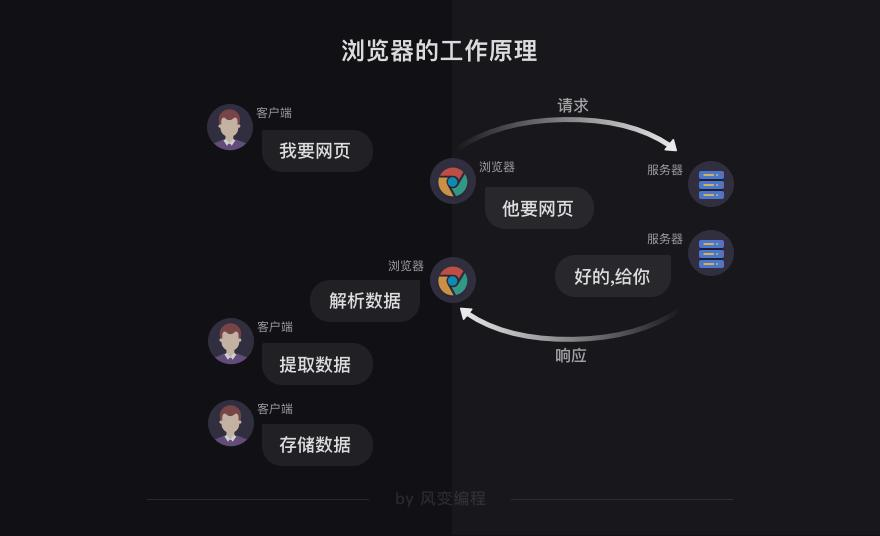

	首先，我们在浏览器输入网址（也可以叫URL）。然后，浏览器向服务器传达了我们想访问某个网页的需求，这个过程就叫做【请求】。
	紧接着，服务器把你想要的网站数据发送给浏览器，这个过程叫做【响应】。
	所以浏览器和服务器之间，先请求，后响应，有这么一层关系。

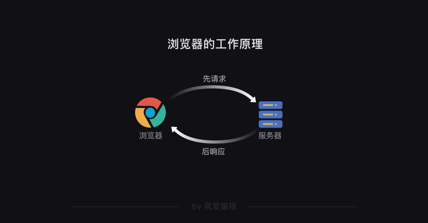

	当服务器把数据响应给浏览器之后，浏览器并不会直接把数据丢给你。因为这些数据是用计算机的语言写的，浏览器还要把这些数据翻译成你能看得懂的样子，这是浏览器做的另一项工作【解析数据】。
	紧接着，我们就可以在拿到的数据中，挑选出对我们有用的数据，这是【提取数据】。
	最后，我们把这些有用的数据保存好，这是【存储数据】。
	以上，就是浏览器的工作原理，是人、浏览器、服务器三者之间的交流过程。

## 爬虫的工作原理

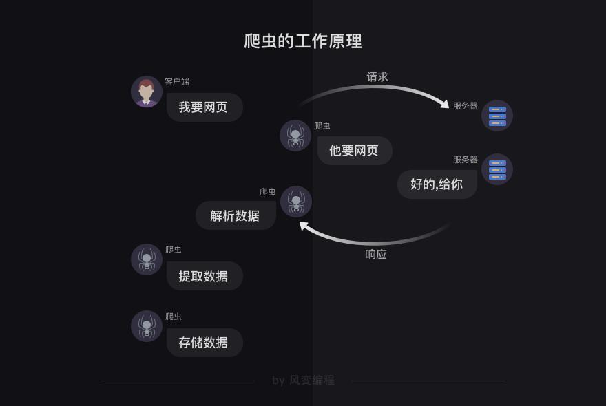

	当你决定去某个网页后，
	首先，爬虫可以模拟浏览器去向服务器发出请求；
	其次，等服务器响应后，爬虫程序还可以代替浏览器帮我们解析数据；
	接着，爬虫可以根据我们设定的规则批量提取相关数据，而不需要我们去手动提取；
	最后，爬虫可以批量地把数据存储到本地。

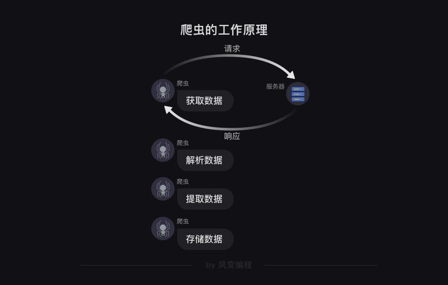

	第0步：获取数据。爬虫程序会根据我们提供的网址，向服务器发起请求，然后返回数据。

	第1步：解析数据。爬虫程序会把服务器返回的数据解析成我们能读懂的格式。

	第2步：提取数据。爬虫程序再从中提取出我们需要的数据。

	第3步：储存数据。爬虫程序把这些有用的数据保存起来，便于你日后的使用和分析。

	这就是爬虫的工作原理啦，无论之后的学习内容怎样变化，其核心都是爬虫原理。

## 爬虫学习大纲

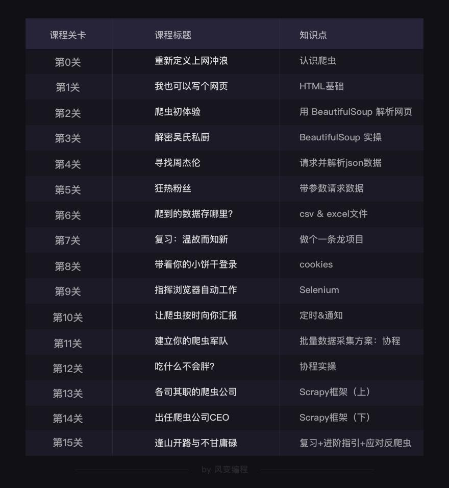

## requests

- requests库可以帮我们下载网页源代码、文本、图片，甚至是音频。
- 其实，“下载”本质上是向服务器发送请求并得到响应。

### resquests.get

---
	import requests
	#引入requests库
	res = requests.get('URL')
	#requests.get是在调用requests库中的get()方法，它向服务器发送了一个请求，括号里的参数是你需要的数据所在的网址，然后服务器对请求作出了响应。
	#服务器返回的结果是个Response对象
---

### Response对象的常用属性

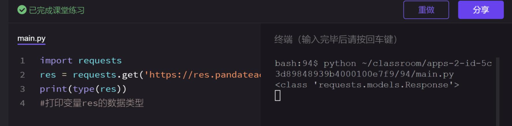  
- res是一个对象，属于requests.models.Response类。

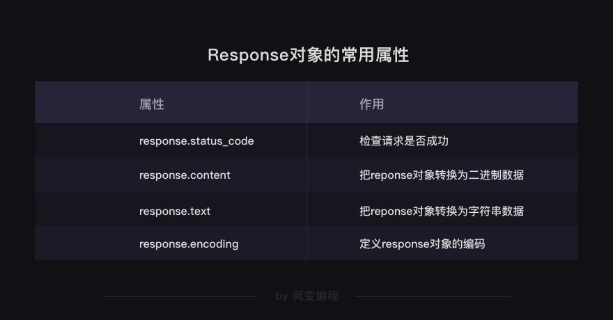

#### response.status_code

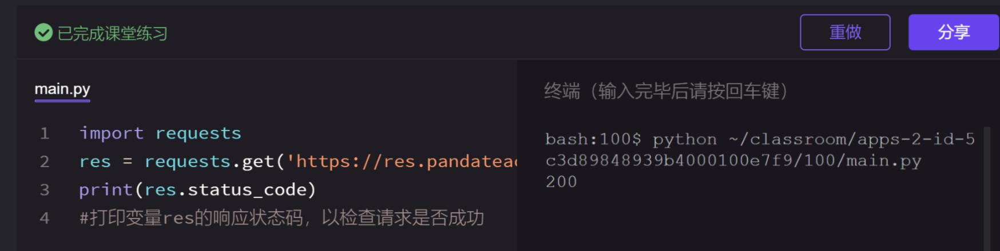  

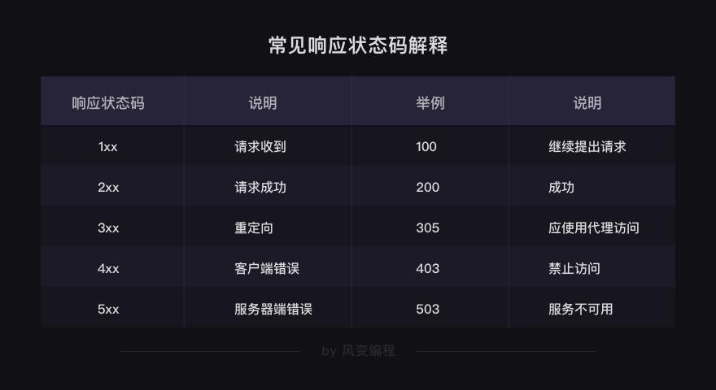

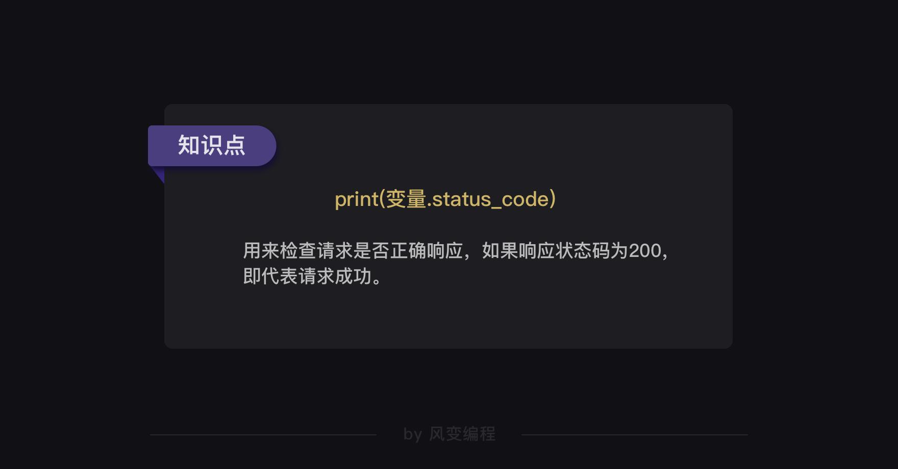

#### response.content

- 它能把Response对象的内容以二进制数据的形式返回，适用于图片、音频、视频的下载

---
	import requests
	res = requests.get('https://res.pandateacher.com/2018-12-18-10-43-07.png')
	#发出请求，并把返回的结果放在变量res中
	pic=res.content
	#把Reponse对象的内容以二进制数据的形式返回
	photo = open('ppt.jpg','wb')
	#新建了一个文件ppt.jpg，这里的文件没加路径，它会被保存在程序运行的当前目录下。
	#图片内容需要以二进制wb读写。你在学习open()函数时接触过它。
	photo.write(pic) 
	#获取pic的二进制内容
	photo.close()
	#关闭文件
---

#### response.text

- 这个属性可以把Response对象的内容以字符串的形式返回，适用于文字、网页源代码的下载。

---
	import requests
	#引用requests库
	res = requests.get('https://localprod.pandateacher.com/python-manuscript/crawler-html/sanguo.md')
	#下载《三国演义》第一回，我们得到一个对象，它被命名为res
	
	res.encoding='utf-8'
	#定义Reponse对象的编码为utf-8。
	novel=res.text
	#把Response对象的内容以字符串的形式返回
	print(novel[:800])
	#打印小说的前800个字。
	
	k = open('《三国演义》.txt','a+')
	#创建一个名为《三国演义》的txt文档，指针放在文件末尾，追加内容
	k.write(novel)
	#写进文件中     
	k.close()
	#关闭文档
---

#### res.encoding
- 它能定义Response对象的编码类型。

---
	在真实的情况中，我们该在什么时候用res.encoding呢？

	首先，目标数据本身是什么编码是未知的。用requests.get()发送请求后，
	我们会取得一个Response对象，其中，requests库会对数据的编码类型做出自己的判断。
	但是！这个判断有可能准确，也可能不准确。

	如果它判断准确的话，我们打印出来的response.text的内容就是正常的、没有乱码的，
	那就用不到res.encoding；如果判断不准确，就会出现一堆乱码，
	那我们就可以去查看目标数据的编码，然后再用res.encoding把编码定义成和目标数据一致的类型即可。

#### requests总结

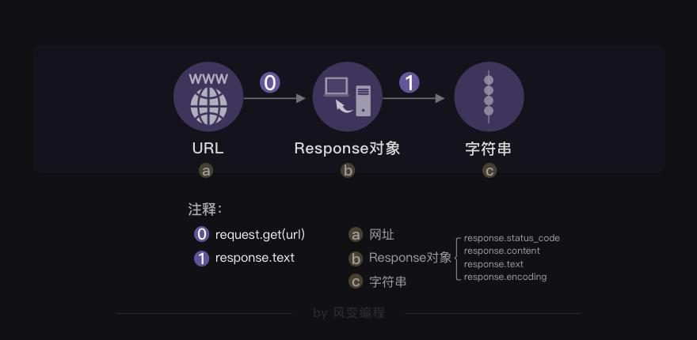

## 爬虫伦理

	Robots协议是互联网爬虫的一项公认的道德规范，它的全称是“网络爬虫排除标准”（Robots exclusion protocol），
	这个协议用来告诉爬虫，哪些页面是可以抓取的，哪些不可以。

- 查看网站的robots协议，在网站的域名后加上/robots.txt。
- [淘宝的robots协议](http://www.taobao.com/robots.txt)
- http://www.taobao.com/robots.txt

---
	User-agent:  Baiduspider #百度爬虫
	Allow:  /article #允许访问 /article.htm
	Allow:  /oshtml #允许访问 /oshtml.htm
	Allow:  /ershou #允许访问 /ershou.htm
	Allow: /$ #允许访问根目录，即淘宝主页
	Disallow:  /product/ #禁止访问/product/
	Disallow:  / #禁止访问除 Allow 规定页面之外的其他所有页面
	​
	User-Agent:  Googlebot #谷歌爬虫
	Allow:  /article
	Allow:  /oshtml
	Allow:  /product #允许访问/product/
	Allow:  /spu
	Allow:  /dianpu
	Allow:  /oversea
	Allow:  /list
	Allow:  /ershou
	Allow: /$
	Disallow:  / #禁止访问除 Allow 规定页面之外的其他所有页面
	​
	…… # 文件太长，省略了对其它爬虫的规定，想看全文的话，点击上面的链接
	​
	User-Agent:  * #其他爬虫
	Disallow:  / #禁止访问所有页面
---

- Allow代表可以被访问，Disallow代表禁止被访问。
- 而且有趣的是，淘宝限制了百度对产品页面的爬虫，却允许谷歌访问。

# HTML基础

- HTML（Hyper Text Markup Language）是用来描述网页的一种语言，也叫超文本标记语言 

## 查看网页的HTML代码

- 在网页任意地方点击鼠标右键，然后点击“显示网页源代码”。
- Windows系统的电脑还可以使用快捷键ctrl+u来查看网页源代码。

这样查看的好处是，整个网页的源代码都完整地呈现在你面前。坏处是，在大部分情况下，它都会经过压缩，导致结构不够清晰，你不太容易懂每行代码的含义。而且，源代码和网页分开在两个页面展示。

- 另一种方法：
- 在网页的空白处点击右键，然后选择“检查”（快捷方式是ctrl+shift+i）。
- 开发者工具栏

## HTML的组成

### 标签和元素

- 夹在尖括号<>中间的字母，它们叫做【标签】。
- 标签通常是成对出现的：前面的是【开始标签】，比如<body>；后面的是【结束标签】，如</body>
- 也有标签是形单影只地出现，比如HTML代码的第四行<meta charset="utf-8">（定义网页编码格式为 utf-8）

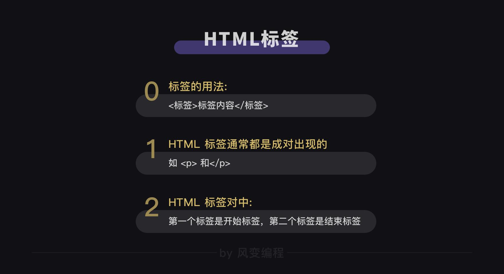

- 开始标签+结束标签+中间的所有内容，它们在一起就组成了【元素】

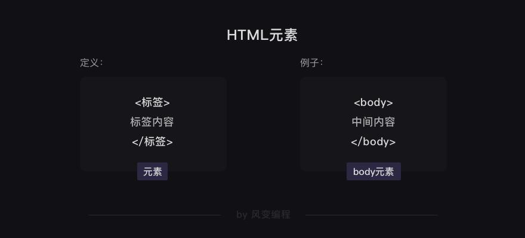

- 常见元素  

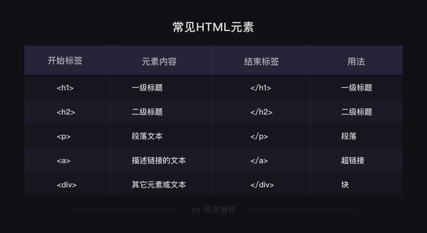

### 网页头和网页体

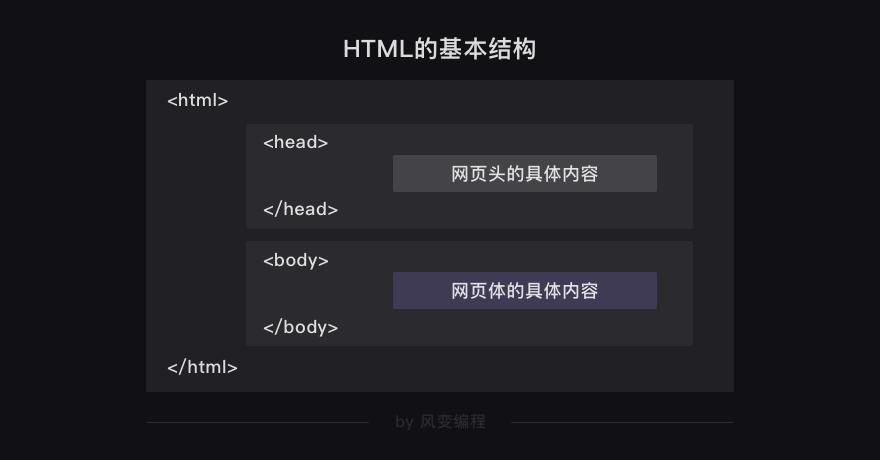

	HTML文档的最外层标签一定是<html>，里面嵌套着<head>元素与<body>元素。
	<head>元素代表了【网页头】，<body>元素代表了【网页体】，
	这是最基本的网页结构。
	HTML文档和网页的内容一定是一一对应的。
	只是，【网页头】的内容不会被直接呈现在浏览器里的网页正文中，
	而【网页体】的内容是会直接显示在网页正文中的。

- 网页头

	<head>
		<meta charset="utf-8">  #定义了HTML文档的字符编码
		<title>我是网页的名字</title> #定义网页的标题，这个标题就是显示在浏览器的标签页中的内容
	</head>

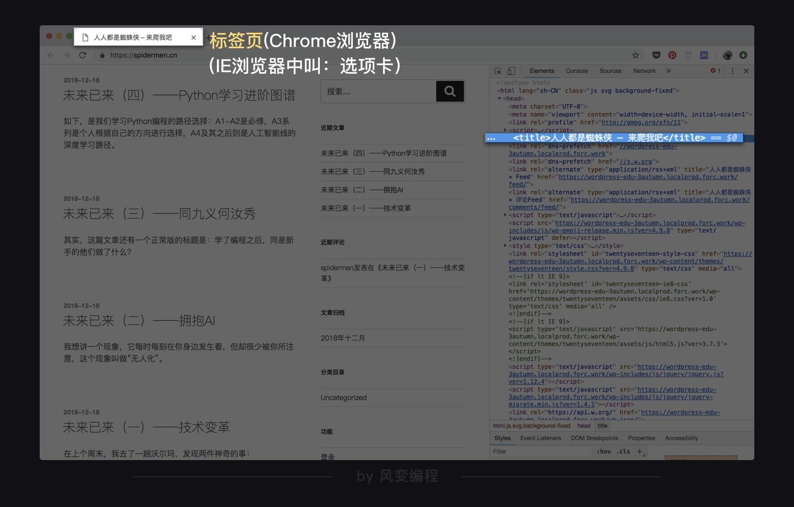

### HTML属性

- HTML标签可以通过设置【属性】来为HTML元素描述更多的信息。

	<h1 style="color:#20b2aa;">这个书苑不太冷</h1>

- style属性可以用来定义网页文本的样式，比如字体大小、颜色、间距、对齐方式等等。

	在HTML中，链接一般都由<a>标签定义，href属性用于规定指向页面的URL
	<a href="https://wordpress-edu-3autumn.localprod.forc.work/">我是一个链接，点我试试</a>
	
	
- class属性

---

	

	一个是网页头里的.book；一个是网页体里的
。

	其实.对应class，所以.book代表class book。因此，网页头中的.book和网页体中的class="book"是有联系的。

	在网页头里面，定义了class属性，属性值为"book"，然后下面一长串代码是对这个class属性的描述；接着再在网页体中调用，所以看到了
。

	在HTML中，class属性也可以被多次利用
	网页头的<style>元素中定义了.book的样式，因此，凡是class="book"的元素都会继承它的样式。
	
---
	
- id属性
- 给元素定义id和class的目的都是为了查找、定位元素，或者为元素设置样式
- 但id属性用于标识唯一的元素，而class用于标识一系列的元素。
- id就像是学生的学生证号码，每个人都是唯一的；而学生们可以属于同一个班级，班级就像class

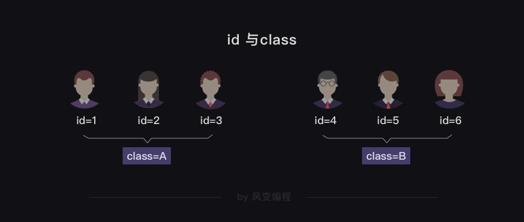

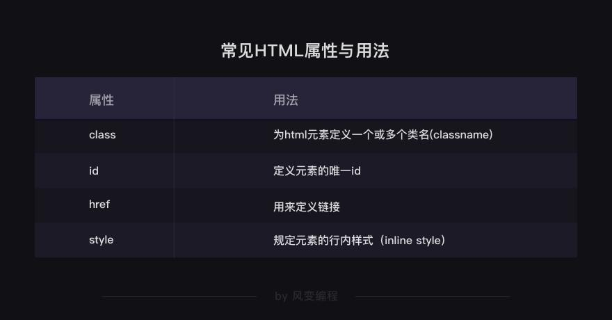

# 爬虫初体验

## BeautifulSoup

- 使用BeautifulSoup解析和提取网页中的数据

### 解析数据

#### BeautifulSoup()
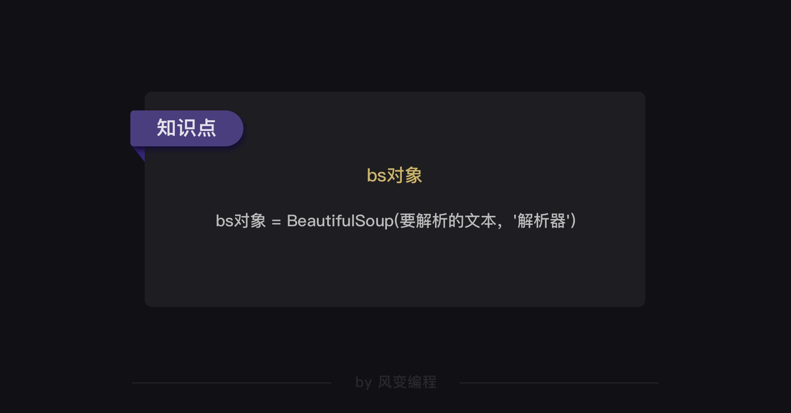

第0个参数是要被解析的文本，注意了，它必须必须必须是字符串。
括号中的第1个参数用来标识解析器，我们要用的是一个Python内置库：html.parser。（它不是唯一的解析器，但是比较简单的）

---
	import requests #调用requests库
	res = requests.get('https://localprod.pandateacher.com/python-manuscript/crawler-html/spider-men5.0.html') 
	#获取网页源代码，得到的res是response对象
	print(res.status_code) #检查请求是否正确响应
	html = res.text #把res的内容以字符串的形式返回
	print(html)#打印html

---

	import requests
	from bs4 import BeautifulSoup
	#引入BS库
	res = requests.get('https://localprod.pandateacher.com/python-manuscript/crawler-html/spider-men5.0.html') 
	html = res.text
	soup = BeautifulSoup(html,'html.parser') #把网页解析为BeautifulSoup对象
	print(type(soup)) #查看soup的类型
	print(soup) # 打印soup

---

	虽然response.text和soup打印出的内容表面上看长得一模一样，却有着不同的内心，
	它们属于不同的类：<class 'str'> 与<class 'bs4.BeautifulSoup'>。
	前者是字符串，后者是已经被解析过的BeautifulSoup对象。
	之所以打印出来的是一样的文本，是因为BeautifulSoup对象在直接打印它的时候会调用该对象内的str方法，所以直接打印 bs 对象显示字符串是str的返回结果

---

### 提取数据

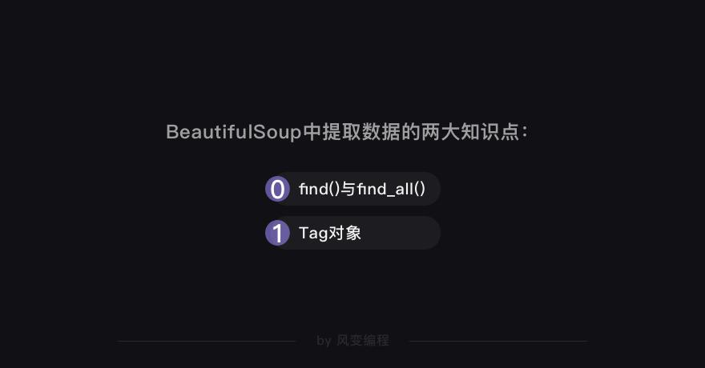

#### find()
- find()与find_all()是BeautifulSoup对象的两个方法

它们可以匹配html的标签和属性，把BeautifulSoup对象里符合要求的数据都提取出来。
它俩的用法基本是一样的，区别在于，find()只提取首个满足要求的数据，而find_all()提取出的是所有满足要求的数据。

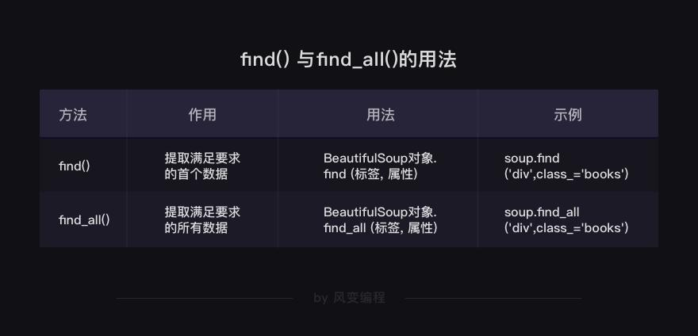
---

	items = soup.find_all('div') #用find_all()把所有符合要求的数据提取出来，并放在变量items里
	print(type(items)) #打印items的数据类型
	print(items)       #打印items
	
	打印items的类型，显示的是<class 'bs4.element.ResultSet'>，
	是一个ResultSet类的对象。其实是Tag对象以列表结构储存了起来，可以把它当做列表来处理。
---

#### tag
- Tag对象
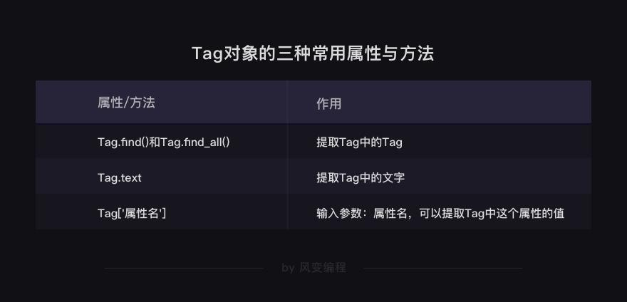

---
	for item in items:
    print('想找的数据都包含在这里了：\n',item) # 打印item
    print(type(item))
	
	它们的数据类型是<class 'bs4.element.Tag'>，是Tag对象

- Tag对象可以使用find()与find_all()来继续检索
	
---	

	items = soup.find_all(class_='books') # 通过定位标签和属性提取我们想要的数据
	for item in items:
		kind = item.find('h2') # 在列表中的每个元素里，匹配标签<h2>提取出数据
		title = item.find(class_='title') #在列表中的每个元素里，匹配属性class_='title'提取出数据
		brief = item.find(class_='info') #在列表中的每个元素里，匹配属性class_='info'提取出数据
		print(kind,'\n',title,'\n',brief) # 打印提取出的数据
		print(type(kind),type(title),type(brief)) # 打印提取出的数据类型

---
- 完整代码

---
	import requests # 调用requests库
	from bs4 import BeautifulSoup # 调用BeautifulSoup库
	res =requests.get('https://localprod.pandateacher.com/python-manuscript/crawler-html/spider-men5.0.html')
	
	html=res.text
	
	soup = BeautifulSoup( html,'html.parser')
	
	items = soup.find_all(class_='books')   # 通过匹配属性class='books'提取出我们想要的元素
	for item in items:                      # 遍历列表items
		kind = item.find('h2')               # 在列表中的每个元素里，匹配标签<h2>提取出数据
		title = item.find(class_='title')     #  在列表中的每个元素里，匹配属性class_='title'提取出数据
		brief = item.find(class_='info')      # 在列表中的每个元素里，匹配属性class_='info'提取出数据
		print(kind.text,'\n',title.text,'\n',title['href'],'\n',brief.text) # 打印书籍的类型、名字、链接和简介的文字

---

## 对象的变化过程

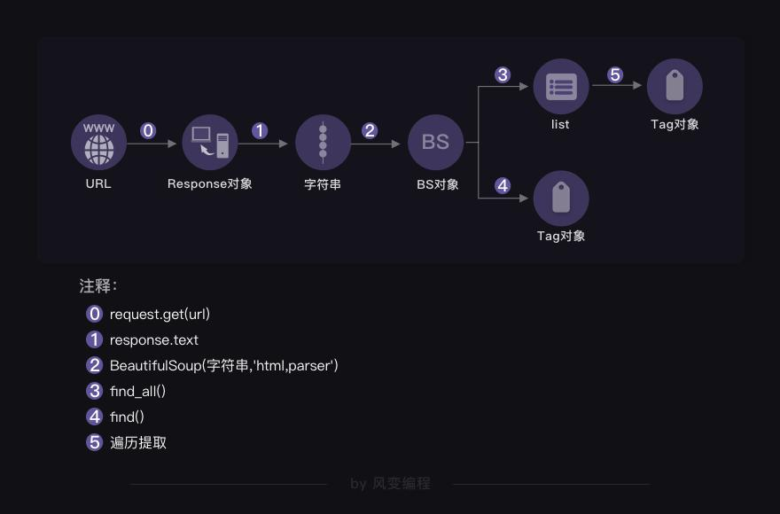

我们的操作对象是这样的：Response对象——字符串——BS对象。
到这里，又产生了两条分岔：一条是BS对象——Tag对象；
另一条是BS对象——列表——Tag对象。

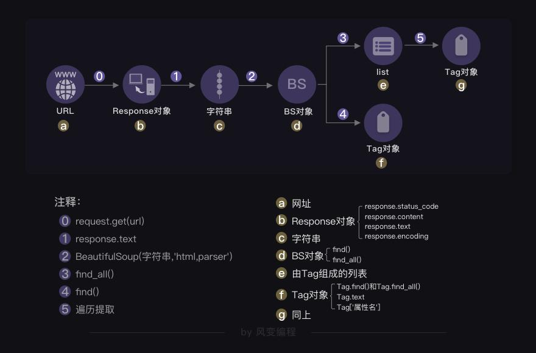

# 下厨房项目

- 先提取每个菜的全部信息，然后写循环，一个一个信息提取
---
	import requests
	from bs4 import BeautifulSoup
	

	res_foods = requests.get('http://www.xiachufang.com/explore/') # 获取数据
	
	bs_foods = BeautifulSoup(res_foods.text,'html.parser') # 解析数据
	list_foods = bs_foods.find_all('div',class_='info pure-u') # 查找最小父级标签

	list_all = [] # 创建一个空列表，用于存储信息

	for food in list_foods:

		tag_a = food.find('a') # 提取第0个父级标签中的<a>标签
		name = tag_a.text[17:-13] # 菜名，使用[17:-13]切掉了多余的信息
		URL = 'http://www.xiachufang.com'+tag_a['href'] # 获取URL
		tag_p = food.find('p',class_='ing ellipsis') # 提取第0个父级标签中的
标签
		ingredients = tag_p.text[1:-1] # 食材，使用[1:-1]切掉了多余的信息
		list_all.append([name,URL,ingredients]) # 将菜名、URL、食材，封装为列表，添加进list_all

	print(list_all) # 打印
	
---	

- 分别提取所有的菜名、所有的URL、所有的食材。然后让菜名、URL、食材给一一对应起来。

---
	import requests # 引用requests库
	from bs4 import BeautifulSoup # 引用BeautifulSoup库

	res_foods = requests.get('http://www.xiachufang.com/explore/') # 获取数据
	bs_foods = BeautifulSoup(res_foods.text,'html.parser') # 解析数据

	tag_name = bs_foods.find_all('p',class_='name') # 查找包含菜名和URL的
标签
	tag_ingredients = bs_foods.find_all('p',class_='ing ellipsis') # 查找包含食材的
标签
	list_all = [] # 创建一个空列表，用于存储信息
	for x in range(len(tag_name)): # 启动一个循环，次数等于菜名的数量
		list_food = [tag_name[x].text[18:-14],tag_name[x].find('a')['href'],tag_ingredients[x].text[1:-1]] 
		提取信息，封装为列表。注意此处[18:-14]切片和之前不同，是因为此处使用的是
标签，而之前是<a>
		list_all.append(list_food) # 将信息添加进list_all
	print(list_all # 打印

---

# 歌单项目

- 网页源代码里没有我们想要的数据,怎么解决？

## Network

- Network的功能是：记录在当前页面上发生的所有请求。

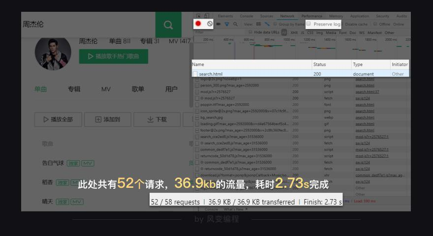

- [周杰伦歌单](https://y.qq.com/portal/search.html#page=1&searchid=1&remoteplace=txt.yqq.top&t=song&w=%E5%91%A8%E6%9D%B0%E4%BC%A6)  

	在图最下面，它告诉我们：此处共有52个请求，36.9kb的流量，耗时2.73s完成。
这个，正是我们的浏览器每时每刻工作的真相：它总是在向服务器，发起各式各样的请求。当这些请求完成，它们会一起组成我们在Elements中看到的网页源代码。
	为什么我们刚才没办法拿到歌曲清单呢？答，这是因为我们刚刚写的代码，只是模拟了这52个请求中的一个（准确来说，就是第0个请求），而这个请求里并不包含歌曲清单。

- 找到这个页面的第0个请求：search.html
- 查看它的Response（官方翻译叫“响应”，你可以理解为服务器对浏览器这个请求的回应内容，即请求的结果）
- 它就是我们刚刚用requests.get()获取到的网页源代码，它里面不包含歌曲清单。

	一般来说，都是这种第0个请求先启动了，其他的请求才会关联启动，一点点地将网页给填充起来。做一个比喻，第0个请求就好比是人的骨架，确定了这个网页的结构。在此之后，众多的请求接连涌入，作为人的血脉经络。
也有一些网页，直接把所有的关键信息都放在第0个请求里，尤其是一些比较老（或比较轻量）的网站，我们用requests和BeautifulSoup就能解决它们。

#### Network用法

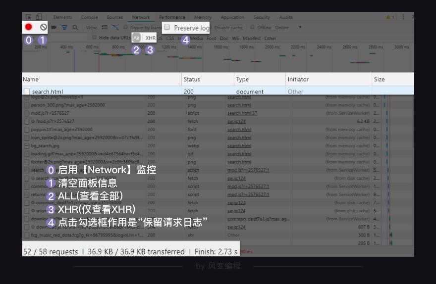

	第0行的左侧，红色的圆钮是启用Network监控（默认高亮打开），灰色圆圈是清空面板上的信息。右侧勾选框Preserve log，它的作用是“保留请求日志”。如果不点击这个，当发生页面跳转的时候，记录就会被清空。所以，我们在爬取一些会发生跳转的网页时，会点亮它。
	第1行，是对请求进行分类查看。我们最常用的是：ALL（查看全部）/XHR（仅查看XHR，我们等会重点讲它）/Doc（Document，第0个请求一般在这里），有时候也会看看：Img（仅查看图片）/Media（仅查看媒体文件）/Other（其他）。最后，JS和CSS，则是前端代码，负责发起请求和页面实现；Font是文字的字体；而理解WS和Manifest，需要网络编程的知识

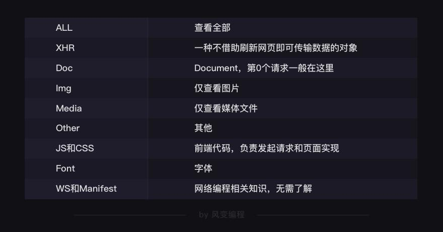

夹在第2行和第1行中间的，是一个时间轴。记录什么时间，有哪些请求。而第2行，就是各个请求

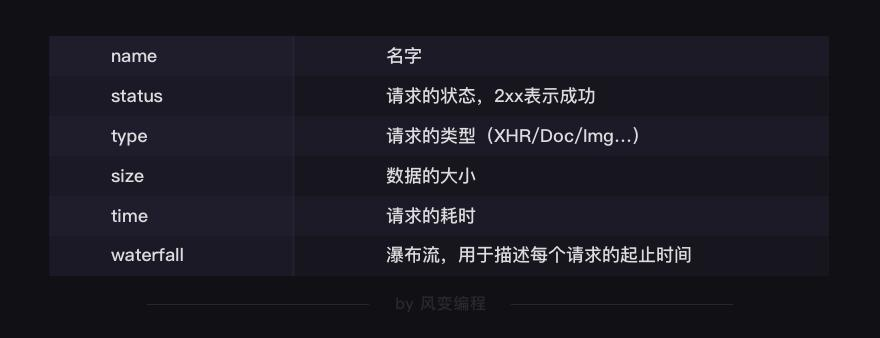

#### XHR

Network中，有一类非常重要的请求叫做XHR（当你把鼠标在XHR上悬停，你可以看到它的完整表述是XHR and Fetch）

我们平时使用浏览器上网的时候，经常有这样的情况：浏览器上方，它所访问的网址没变，但是网页里却新加了内容。

典型代表：如购物网站，下滑自动加载出更多商品。在线翻译网站，输入中文实时变英文。比如，你正在使用的教学系统，每点击一次Enter就有新的内容弹出。

这个，叫做Ajax技术（技术本身和爬虫关系不大，在此不做展开，你可以通过搜索了解）。应用这种技术，好处是显而易见的——更新网页内容，而不用重新加载整个网页。又省流量又省时间的。

如今，比较新潮的网站都在使用这种技术来实现数据传输。只剩下一些特别老，或是特别轻量的网站，还在用老办法——加载新的内容，必须要跳转一个新网址。

这种技术在工作的时候，会创建一个XHR（或是Fetch）对象，然后利用XHR对象来实现，服务器和浏览器之间传输数据。在这里，XHR和Fetch并没有本质区别，只是Fetch出现得比XHR更晚一些，所以对一些开发人员来说会更好用，但作用都是一样的。

- 我们的歌曲清单不在网页源代码里，而且也不是图片，不是媒体文件，自然只会是在XHR里
- 点击查看XHR

从左往右分别是：Headers：标头（请求信息）、Preview：预览、Response：原始信息、Timing：时间。

- 点击Preview，你能在里面发现我们想要的信息：歌名就藏在里面！
- 那如何把这些歌曲名拿到呢？这就需要我们去看看最左侧的Headers

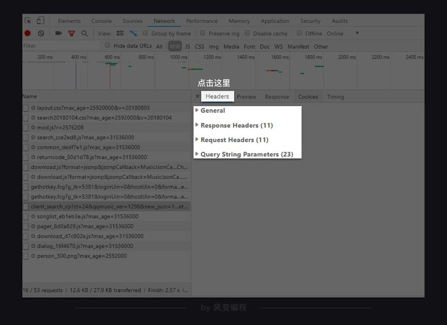

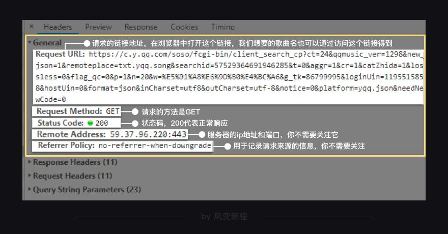

- General里的Requests URL就是我们应该去访问的链接

	import requests # 引用requests库
	res = requests.get('https://c.y.qq.com/soso/fcgi-bin/client_search_cp?ct=24&qqmusic_ver=1298&new_json=1&remoteplace=txt.yqq.song&searchid=60997426243444153&t=0&aggr=1&cr=1&catZhida=1&lossless=0&flag_qc=0&p=1&n=20&w=%E5%91%A8%E6%9D%B0%E4%BC%A6&g_tk=5381&loginUin=0&hostUin=0&format=json&inCharset=utf8&outCharset=utf-8&notice=0&platform=yqq.json&needNewCode=0')
	调用get方法，下载这个字典
	print(res.text)
	把它打印出来
	
	
- 使用res.text取到的，是字符串。它不是我们想要的列表/字典，数据取不出来。

#### json

- 在Python语言当中，json是一种特殊的字符串，这种字符串特殊在它的写法——它是用列表/字典的语法写成的

	a = '1,2,3,4'
	 这是字符串
	b = [1,2,3,4]
	 这是列表
	c = '[1,2,3,4]'
	 这是字符串，但它是用json格式写的字符串

- 组织数据的方式也有规律，规律有三条：

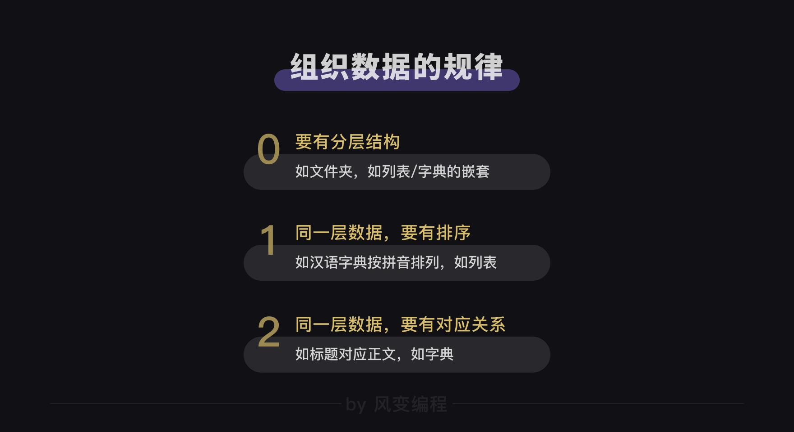

json则是另一种组织数据的格式，长得和Python中的列表/字典非常相像。它和html一样，常用来做网络数据传输。刚刚我们在XHR里查看到的列表/字典，严格来说其实它不是列表/字典，它是json。

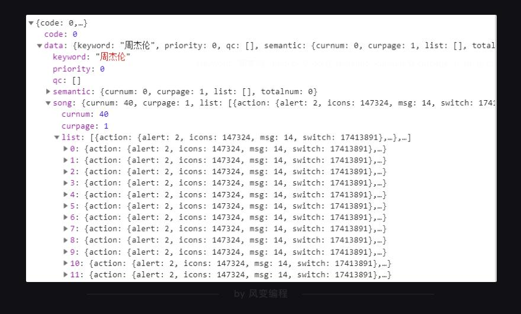

为什么要把它表示成字符串？答案很简单，因为不是所有的编程语言都能读懂Python里的数据类型（如，列表/字符串），但是所有的编程语言，都支持文本（比如在Python中，用字符串这种数据类型来表示文本）这种最朴素的数据类型。

如此，json数据才能实现，跨平台，跨语言工作。

而json和XHR之间的关系：XHR用于传输数据，它能传输很多种数据，json是被传输的一种数据格式。

我们总是可以将json格式的数据，转换成正常的列表/字典，也可以将列表/字典，转换成json。

#### 解析json

- 查看requests库处理json数据的方法

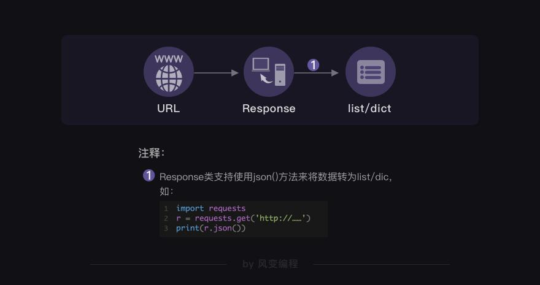

---
	import requests
	 引用requests库
	res_music = requests.get('https://c.y.qq.com/soso/fcgi-bin/client_search_cp?ct=24&qqmusic_ver=1298&new_json=1&remoteplace=txt.yqq.song&searchid=60997426243444153&t=0&aggr=1&cr=1&catZhida=1&lossless=0&flag_qc=0&p=1&n=20&w=%E5%91%A8%E6%9D%B0%E4%BC%A6&g_tk=5381&loginUin=0&hostUin=0&format=json&inCharset=utf8&outCharset=utf-8&notice=0&platform=yqq.json&needNewCode=0')
	 调用get方法，下载这个字典
	json_music = res_music.json()
	 使用json()方法，将response对象，转为列表/字典
	list_music = json_music['data']['song']['list']
	 一层一层地取字典，获取歌单列表
	for music in list_music:
	 list_music是一个列表，music是它里面的元素
		print(music['name'])
		 以name为键，查找歌曲名
		print('所属专辑：'+music['album']['name'])
		 查找专辑名
		print('播放时长：'+str(music['interval'])+'秒')
		 查找播放时长
		print('播放链接：https://y.qq.com/n/yqq/song/'+music['mid']+'.html\n\n')
		 查找播放链接

---

# 歌曲评论项目

## 利用XHR找数据

- 学会如何判断我们想要的信息是在Html，还是在XHR里：

## 带参数请求数据

读懂参数，有两个重要的方法是“观察”和“比较”。
“观察”指的是阅读参数的键与值，尝试理解它的含义。“比较”指的是比较两个相近的XHR——它们有哪些不同，对应的页面显示内容有什么不同。

---
	import requests
	 引用requests模块
	for i in range(5):
		res_comments = requests.get('https://c.y.qq.com/base/fcgi-bin/fcg_global_comment_h5.fcg?g_tk=5381&loginUin=0&hostUin=0&format=json&inCharset=utf8&outCharset=GB2312&notice=0&platform=yqq.json&needNewCode=0&cid=205360772&reqtype=2&biztype=1&topid=102065756&cmd=6&needmusiccrit=0&pagenum='+str(i)+'&pagesize=15&lasthotcommentid=song_102065756_3202544866_44059185&domain=qq.com&ct=24&cv=10101010')
		 调用get方法，下载评论列表
		json_comments = res_comments.json()
		 使用json()方法，将response对象，转为列表/字典
		list_comments = json_comments['comment']['commentlist']
		 一层一层地取字典，获取评论列表
		for comment in list_comments:
		 list_comments是一个列表，comment是它里面的元素
			print(comment['rootcommentcontent'])
			 输出评论
			print('-----------------------------------')
			 将不同的评论分隔开来

---

我们来让这个代码变好看些。事实上，requests模块里的requests.get()提供了一个参数叫params，可以让我们用字典的形式，把参数传进去。

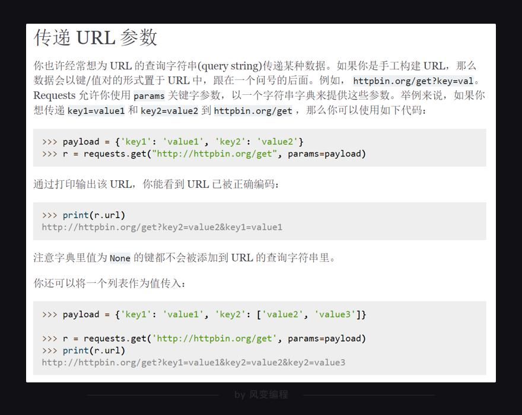

所以，其实我们可以把Query String Parametres里的内容，直接复制下来，封装为一个字典，传递给params。只是有一点要特别注意：要给他们打引号，让它们变字符串。

---
	import requests
	 引用requests模块
	url = 'https://c.y.qq.com/base/fcgi-bin/fcg_global_comment_h5.fcg'
	 请求歌曲评论的url参数的前面部分

	for i in range(5):
		params = {
		'g_tk':'5381',
		'loginUin':'0', 
		'hostUin':'0',
		'format':'json',
		'inCharset':'utf8',
		'outCharset':'GB2312',
		'notice':'0',
		'platform':'yqq.json',
		'needNewCode':'0',
		'cid':'205360772',
		'reqtype':'2',
		'biztype':'1',
		'topid':'102065756',
		'cmd':'6',
		'needmusiccrit':'0',
		'pagenum':str(i),
		'pagesize':'15',
		'lasthotcommentid':'song_102065756_3202544866_44059185',
		'domain':'qq.com',
		'ct':'24',
		'cv':'10101010'   
		}
		 将参数封装为字典
		res_comments = requests.get(url,params=params)
		 调用get方法，下载这个字典
		json_comments = res_comments.json()
		list_comments = json_comments['comment']['commentlist']
		for comment in list_comments:
			print(comment['rootcommentcontent'])
			print('-----------------------------------')

---

## Request Headers
- 服务器怎么判断访问者是一个普通的用户（通过浏览器），还是一个爬虫者（通过代码）

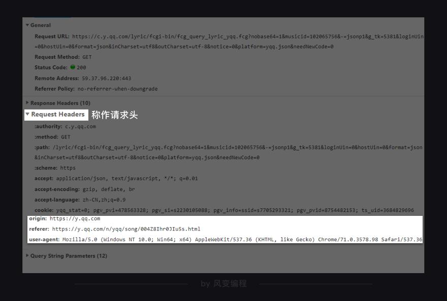

Requests Headers，我们把它称作请求头。它里面会有一些关于该请求的基本信息，比如：这个请求是从什么设备什么浏览器上发出？这个请求是从哪个页面跳转而来？
user-agent（中文：用户代理）会记录你电脑的信息和浏览器版本（如我的，就是windows10的64位操作系统，使用谷歌浏览器）
origin（中文：源头）和referer（中文：引用来源）则记录了这个请求，最初的起源是来自哪个页面。它们的区别是referer会比origin携带的信息更多些。
如果我们想告知服务器，我们不是爬虫是一个正常的浏览器，就要去修改user-agent。倘若不修改，那么这里的默认值就会是Python，会被浏览器认出来。

### 添加Requests Headers

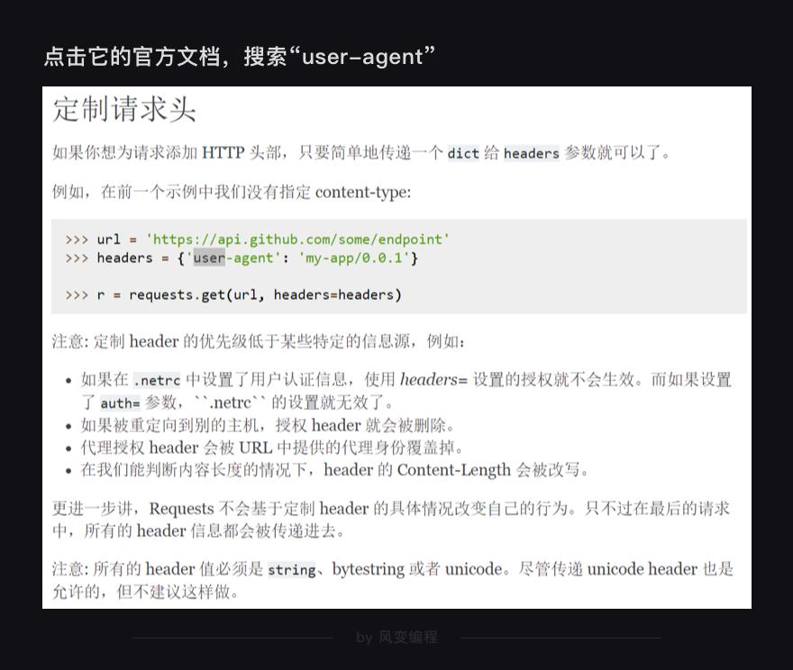

---
	import requests
	url = 'https://c.y.qq.com/soso/fcgi-bin/client_search_cp'

	headers = {
		'origin':'https://y.qq.com',
		 请求来源，本案例中其实是不需要加这个参数的，只是为了演示
		'referer':'https://y.qq.com/n/yqq/song/004Z8Ihr0JIu5s.html',
		 请求来源，携带的信息比“origin”更丰富，本案例中其实是不需要加这个参数的，只是为了演示
		'user-agent':'Mozilla/5.0 (Windows NT 10.0; Win64; x64) AppleWebKit/537.36 (KHTML, like Gecko) Chrome/71.0.3578.98 Safari/537.36',
		 标记了请求从什么设备，什么浏览器上发出
		}
	 伪装请求头

	params = {
	'ct':'24',
	'qqmusic_ver': '1298',
	'new_json':'1',
	'remoteplace':'sizer.yqq.song_next',
	'searchid':'64405487069162918',
	't':'0',
	'aggr':'1',
	'cr':'1',
	'catZhida':'1',
	'lossless':'0',
	'flag_qc':'0',
	'p':1,
	'n':'20',
	'w':'周杰伦',
	'g_tk':'5381',
	'loginUin':'0',
	'hostUin':'0',
	'format':'json',
	'inCharset':'utf8',
	'outCharset':'utf-8',
	'notice':'0',
	'platform':'yqq.json',
	'needNewCode':'0'    
	}
	 将参数封装为字典
	res_music = requests.get(url,headers=headers,params=params)
	 发起请求，填入请求头和参数

---

一个url由两部分组成，?（有时候是“#”）之前是我们请求的地址，?之后是我们的请求所附带的参数。通常，我们会把参数封装成一个字典，添加进请求中去。

# 数据存储

## 存储数据的方式
- 常用的存储数据的方式有两种——存储成csv格式文件、存储成Excel文件

csv是一种字符串文件的格式，它组织数据的语法就是在字符串之间加分隔符——行与行之间是加换行符，同列之间是加逗号分隔。

它可以用任意的文本编辑器打开（如记事本），也可以用Excel打开，还可以通过Excel把文件另存为csv格式（因为Excel支持csv格式文件）。

## 存储数据的基础知识

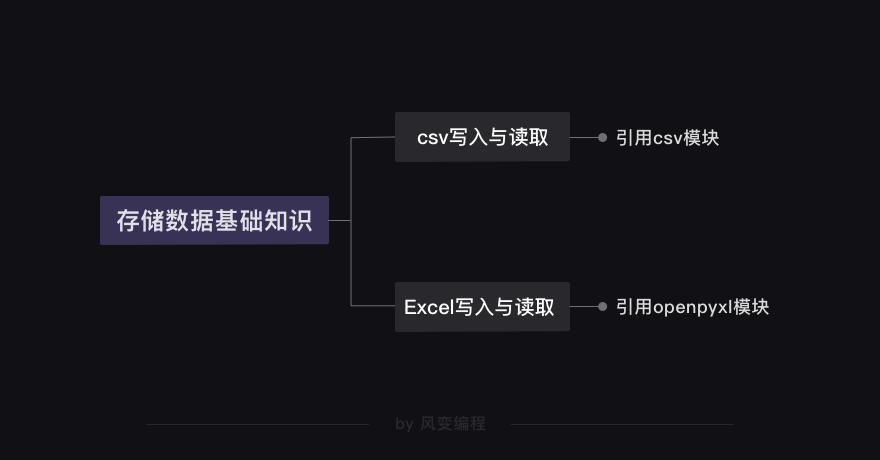

- 操作csv文件我们需要借助csv模块；操作Excel文件则需要借助openpyxl模块。

### csv写入与读取

	import csv
	引用csv模块。
	csv_file = open('demo.csv','w',newline='',encoding='utf-8')
	创建csv文件，我们要先调用open()函数，传入参数：文件名“demo.csv”、写入模式“w”、newline=''、encoding='utf-8'。

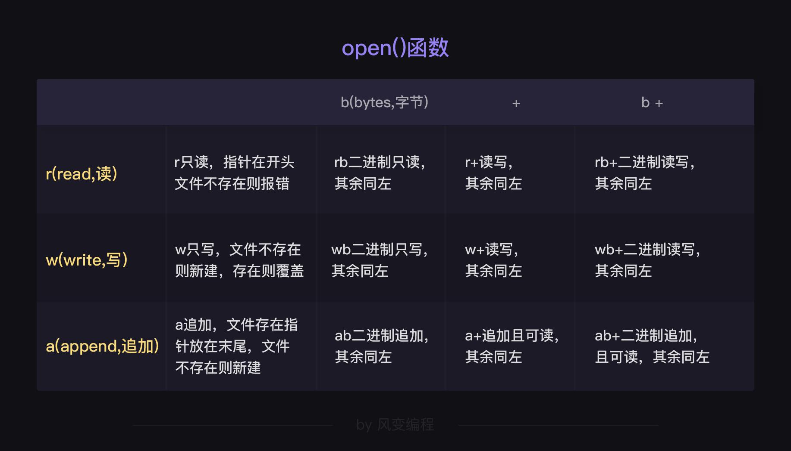

加newline=' '参数的原因是，可以避免csv文件出现两倍的行距（就是能避免表格的行与行之间出现空白行）。加encoding='utf-8'，可以避免编码问题导致的报错或乱码。

创建完csv文件后，我们要借助csv.writer()函数来建立一个writer对象。
用writer对象的writerow()方法，往csv文件里写入新的内容。
writerow()函数里，需要放入列表参数，所以我们得把要写入的内容写成列表。就像['电影','豆瓣评分']。

---
	import csv
	引用csv模块。
	csv_file = open('demo.csv','w',newline='',encoding='utf-8')
	调用open()函数打开csv文件，传入参数：文件名“demo.csv”、写入模式“w”、newline=''、encoding='utf-8'。
	writer = csv.writer(csv_file)
	 用csv.writer()函数创建一个writer对象。
	writer.writerow(['电影','豆瓣评分'])
	调用writer对象的writerow()方法，可以在csv文件里写入一行文字 “电影”和“豆瓣评分”。
	writer.writerow(['银河护卫队','8.0'])
	在csv文件里写入一行文字 “银河护卫队”和“8.0”。
	writer.writerow(['复仇者联盟','8.1'])
	在csv文件里写入一行文字 “复仇者联盟”和“8.1”。
	csv_file.close()
	写入完成后，关闭文件就大功告成啦！
---

- [csv模块官方文档链接](https://yiyibooks.cn/xx/python_352/library/csv.html#module-csv)

### Excel写入与读取

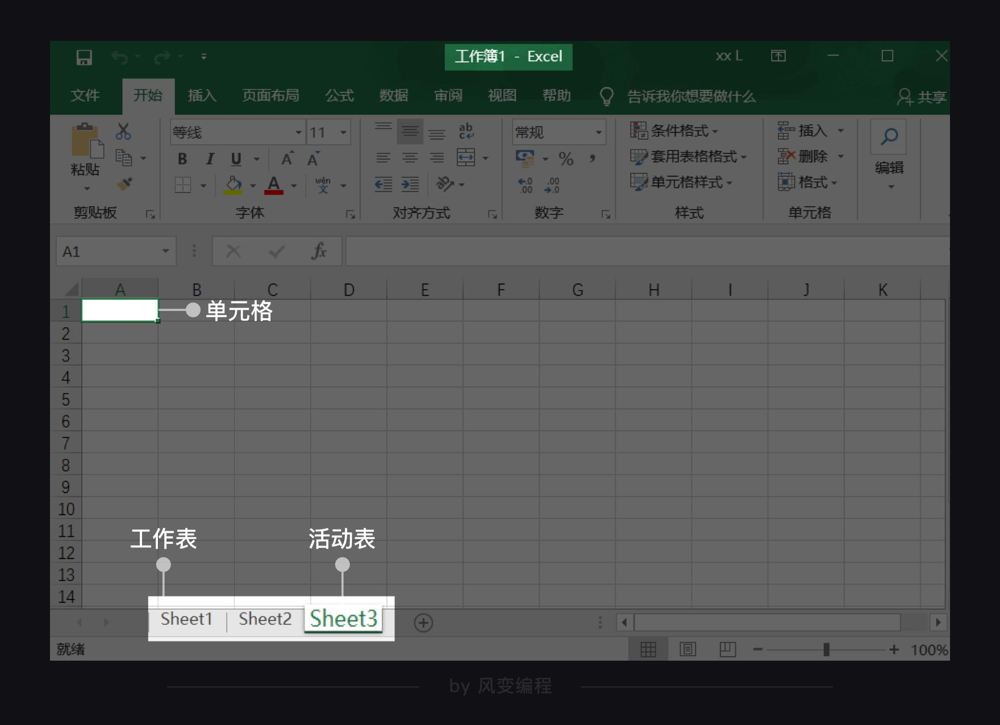

一个Excel文档也称为一个工作薄（workbook），每个工作薄里可以有多个工作表（wordsheet），当前打开的工作表又叫活动表。

---
	import openpyxl 
	引用openpyxl。
	wb = openpyxl.Workbook()
	利用openpyxl.Workbook()函数创建新的workbook（工作薄）对象，就是创建新的空的Excel文件。
	
	创建完新的工作薄后，还得获取工作表。不然程序会懵逼，不知道要把内容写入哪张工作表里。
	sheet = wb.active
	wb.active
	就是获取这个工作薄的活动表，通常就是第一个工作表。
	sheet.title = 'new title'
	可以用.title给工作表重命名。现在第一个工作表的名称就会由原来默认的“sheet1”改为"new title"。

	添加完工作表，我们就能来操作单元格，往单元格里写入内容。
	heet['A1'] = '漫威宇宙' 
	把'漫威宇宙'赋值给第一个工作表的A1单元格，就是往A1的单元格中写入了'漫威宇宙'。

	往工作表里写入一行内容的话，就得用到append函数
	row = ['美国队长','钢铁侠','蜘蛛侠']
	把我们想写入的一行内容写成列表，赋值给row。
	sheet.append(row)
	用sheet.append()就能往表格里添加这一行文字。

	wb.save('Marvel.xlsx')
	保存新建的Excel文件，并命名为“Marvel.xlsx”
	
	读取的代码：
	wb = openpyxl.load_workbook('Marvel.xlsx')
	sheet = wb['new title']
	sheetname = wb.sheetnames
	print(sheetname)
	A1_cell = sheet['A1']
	A1_value = A1_cell.value
	print(A1_value)
---

- [openpyxl模块的官方文档](https://openpyxl.readthedocs.io/en/stable/)

# 爬取知乎大v张佳玮的文章

## 复习

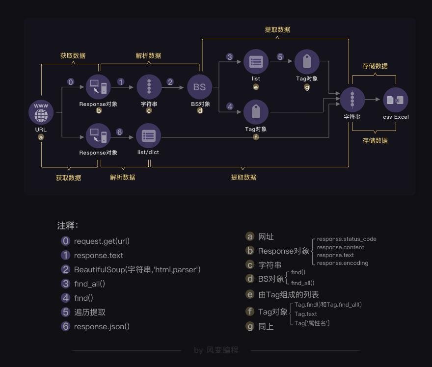

从Response对象开始，我们就分成了两条路径，一条路径是数据放在HTML里，所以我们用BeautifulSoup库去解析数据和提取数据；另一条，数据作为Json存储起来，所以我们用response.json()方法去解析，然后提取、存储数据。

---
	import requests
	import csv
	引用csv。
	csv_file=open('articles.csv','w',newline='',encoding='utf-8')
	调用open()函数打开csv文件，传入参数：文件名“articles.csv”、写入模式“w”、newline=''。
	writer = csv.writer(csv_file)
	 用csv.writer()函数创建一个writer对象。
	list2=['标题','链接','摘要']
	创建一个列表
	writer.writerow(list2)
	调用writer对象的writerow()方法，可以在csv文件里写入一行文字 “标题”和“链接”和"摘要"。
	
	headers={'user-agent':'Mozilla/5.0 (Macintosh; Intel Mac OS X 10_13_6) AppleWebKit/537.36 (KHTML, like Gecko) Chrome/71.0.3578.98 Safari/537.36'}
	url='https://www.zhihu.com/api/v4/members/zhang-jia-wei/articles?'
	articlelist=[]
	建立一个空列表，以待写入数据
	offset=0
	设置offset的起始值为0
	
	while True:
		params={
			'include':'data[*].comment_count,suggest_edit,is_normal,thumbnail_extra_info,thumbnail,can_comment,comment_permission,admin_closed_comment,content,voteup_count,created,updated,upvoted_followees,voting,review_info,is_labeled,label_info;data[*].author.badge[?(type=best_answerer)].topics',
			'offset':str(offset),
			'limit':'20',
			'sort_by':'voteups',
			}
		封装参数
		res=requests.get(url,headers=headers,params=params)
		发送请求，并把响应内容赋值到变量res里面
		articles=res.json()
		 print(articles)
		data=articles['data']
		定位数据
		for i in data:
			list1=[i['title'],i['url'],i['excerpt']]
			#把数据封装成列表
			articlelist.append(list1)
			writer.writerow(list1)
        调用writerow()方法，把列表list1的内容写入
		offset=offset+20
		在while循环内部，offset的值每次增加20
		if offset>40:
			break
		如果offset大于40，即爬了两页，就停止
		if articles['paging']['is_end'] == True:
		如果键is_end所对应的值是True，就结束while循环。
			break
	print(articlelist)
	打印看看
	
	csv_file.close()
	写入完成后，关闭文件就大功告成
---

# cookies

## post请求

- [蜘蛛侠网站](https://wordpress-edu-3autumn.localprod.forc.work/wp-login.php)
- 账号：spiderman，密码：crawler334566

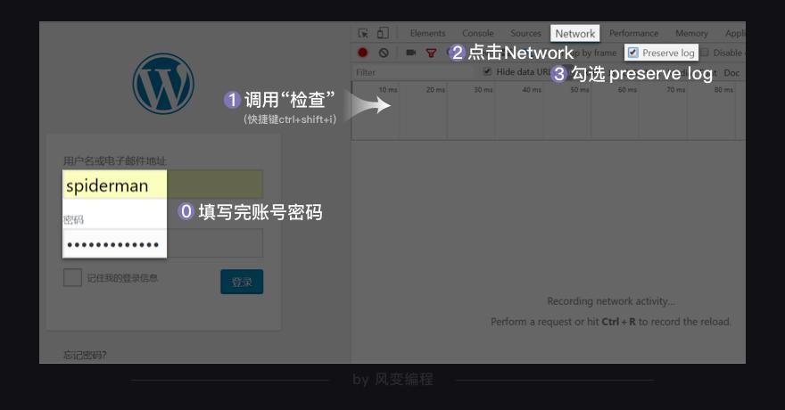

上图左边是“正常人”的操作：填上账号和密码；右边我们可以用工程师的思维，来分析浏览器的登录请求是怎么发送的。你需要做的是：先正常操作——填写完账号密码（别点击登录），再用工程师的做法操作：右击打开“检查”工具，点击【network】，勾选【preserve log】（持续显示请求记录，防止请求记录被刷新）。

展开第0个请求【wp-login.php】，浏览一下【headers】。在【General】键里，我们可以先只看前两个参数【Request URL】（请求网址）和【Request Method】（请求方式）。

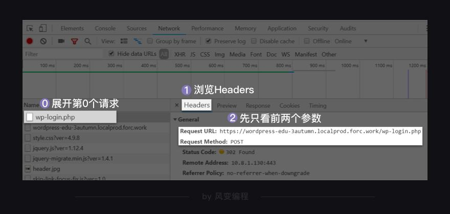

这里的请求方式是post，而不是我们之前学过的get。

## post与get区别

- 其实，post和get都可以带着参数请求，不过get请求的参数会在url上显示出来。

但post请求的参数就不会直接显示，而是隐藏起来。像账号密码这种私密的信息，就应该用post的请求。如果用get请求的话，账号密码全部会显示在网址上，这显然不科学！你可以这么理解，get是明文显示，post是非明文显示。

通常，get请求会应用于获取网页数据，比如我们之前学的requests.get()。post请求则应用于向网页提交数据，比如提交表单类型数据（像账号密码就是网页表单的数据）。

get和post是两种最常用的请求方式，除此之外，还有其他类型的请求方式，如head、options等

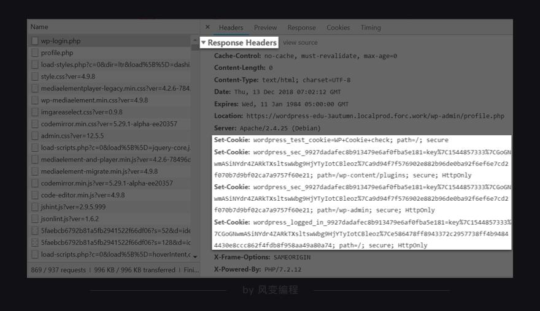

【requests headers】存储的是浏览器的请求信息，【response headers】存储的是服务器的响应信息。我们这一关要找的cookies就在其中。

你会看到在【response headers】里有set cookies的参数。set cookies是什么意思？就是服务器往浏览器写入了cookies。

## cookies及其用法

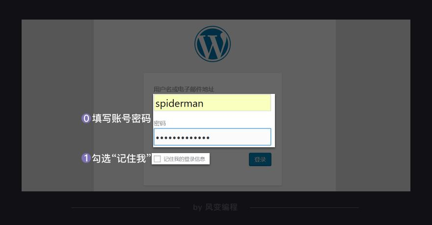

当你登录博客账号spiderman，并勾选“记住我”，服务器就会生成一个cookies和spiderman这个账号绑定。接着，它把这个cookies告诉你的浏览器，让浏览器把cookies存储到你的本地电脑。当下一次，浏览器带着cookies访问博客，服务器会知道你是spiderman，你不需要再重复输入账号密码，即可直接访问。

当然，cookies也是有时效性的，过期后就会失效。你应该有过这样的体验：哪怕勾选了“记住我”，但一段时间过去了，网站还是会提示你要重新登录，就是之前的cookies已经失效。

---
	import requests
	引入requests。
	url = ' https://wordpress-edu-3autumn.localprod.forc.work/wp-login.php'
	把请求登录的网址赋值给url。
	headers = {
	'User-Agent':'Mozilla/5.0 (Windows NT 10.0; Win64; x64) AppleWebKit/537.36 (KHTML, like Gecko) Chrome/70.0.3538.110 Safari/537.36'
	}
	加请求头，前面有说过加请求头是为了模拟浏览器正常的访问，避免被反爬虫。
	data = {
	'log': 'spiderman',  #写入账户
	'pwd': 'crawler334566',  #写入密码
	'wp-submit': '登录',
	'redirect_to': 'https://wordpress-edu-3autumn.localprod.forc.work/wp-admin/',
	'testcookie': '1'
	}
	把有关登录的参数封装成字典，赋值给data。
	login_in = requests.post(url,headers=headers,data=data)
	用requests.post发起请求，放入参数：请求登录的网址、请求头和登录参数，然后赋值给login_in。
	cookies = login_in.cookies
	提取cookies的方法：调用requests对象（login_in）的cookies属性获得登录的cookies，并赋值给变量cookies。

	url_1 = 'https://wordpress-edu-3autumn.localprod.forc.work/wp-comments-post.php'
	我们想要评论的文章网址。
	data_1 = {
	'comment': input('请输入你想要发表的评论：'),
	'submit': '发表评论',
	'comment_post_ID': '13',
	'comment_parent': '0'
	}
	把有关评论的参数封装成字典。
	comment = requests.post(url_1,headers=headers,data=data_1,cookies=cookies)
	用requests.post发起发表评论的请求，放入参数：文章网址、headers、评论参数、cookies参数，赋值给comment。
	调用cookies的方法就是在post请求中传入cookies=cookies的参数。
	print(comment.status_code)
	打印出comment的状态码，若状态码等于200，则证明我们评论成功。

---

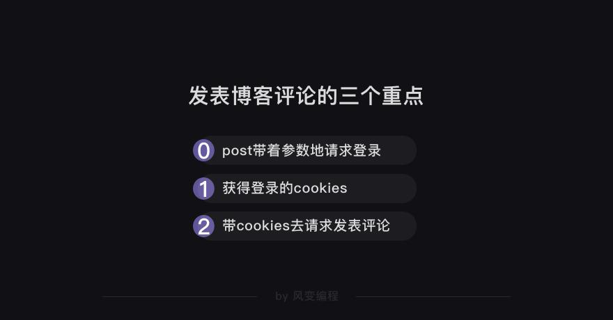

## session及其用法

所谓的会话，你可以理解成我们用浏览器上网，到关闭浏览器的这一过程。session是会话过程中，服务器用来记录特定用户会话的信息。

比如你打开浏览器逛购物网页的整个过程中，浏览了哪些商品，在购物车里放了多少件物品，这些记录都会被服务器保存在session中。

- session和cookies的关系还非常密切——cookies中存储着session的编码信息，session中又存储了cookies的信息。

当浏览器第一次访问购物网页时，服务器会返回set cookies的字段给浏览器，而浏览器会把cookies保存到本地。

等浏览器第二次访问这个购物网页时，就会带着cookies去请求，而因为cookies里带有会话的编码信息，服务器立马就能辨认出这个用户，同时返回和这个用户相关的特定编码的session。

这也是为什么你每次重新登录购物网站后，你之前在购物车放入的商品并不会消失的原因。因为你在登录时，服务器可以通过浏览器携带的cookies，找到保存了你购物车信息的session。

---
	- 创建session来处理cookies。

	

	---
	import requests
	引用requests。
	session = requests.session()
	用requests.session()创建session对象，相当于创建了一个特定的会话，帮我们自动保持了cookies。
	url = 'https://wordpress-edu-3autumn.localprod.forc.work/wp-login.php'
	headers = {
	'User-Agent':'Mozilla/5.0 (Windows NT 10.0; WOW64) AppleWebKit/537.36 (KHTML, like Gecko) Chrome/71.0.3578.98 Safari/537.36'
	}
	data = {
		'log':input('请输入账号：'), #用input函数填写账号和密码，这样代码更优雅，而不是直接把账号密码填上去。
		'pwd':input('请输入密码：'),
		'wp-submit':'登录',
		'redirect_to':'https://wordpress-edu-3autumn.localprod.forc.work/wp-admin/',
		'testcookie':'1'
	}
	session.post(url,headers=headers,data=data)
	在创建的session下用post发起登录请求，放入参数：请求登录的网址、请求头和登录参数。

	url_1 = 'https://wordpress-edu-3autumn.localprod.forc.work/wp-comments-post.php'
	把我们想要评论的文章网址赋值给url_1。
	data_1 = {
	'comment': input('请输入你想要发表的评论：'),
	'submit': '发表评论',
	'comment_post_ID': '13',
	'comment_parent': '0'
	}
	把有关评论的参数封装成字典。
	comment = session.post(url_1,headers=headers,data=data_1)
	在创建的session下用post发起评论请求，放入参数：文章网址，请求头和评论参数，并赋值给comment。
	print(comment)
打印comment

---

## 存储cookies

cookies能帮我们保存登录的状态，那我们就在第一次登录时把cookies存储下来，等下次登录再把存储的cookies读取出来，这样就不用重复输入账号密码了。

---
	import requests
	session = requests.session()
	url = 'https://wordpress-edu-3autumn.localprod.forc.work/wp-login.php'
	headers = {
	'User-Agent':'Mozilla/5.0 (Windows NT 10.0; WOW64) AppleWebKit/537.36 (KHTML, like Gecko) Chrome/71.0.3578.98 Safari/537.36'
	}
	data = {
		'log':input('请输入账号：'),
		'pwd':input('请输入密码：'),
		'wp-submit':'登录',
		'redirect_to':'https://wordpress-edu-3autumn.localprod.forc.work/wp-admin/',
		'testcookie':'1'
	}
	session.post(url,headers=headers,data=data)
	print(type(session.cookies))
	打印cookies的类型,session.cookies就是登录的cookies
	print(session.cookies)
	打印cookies
---

RequestsCookieJar是cookies对象的类，cookies本身的内容有点像一个列表，里面又有点像字典的键与值

json模块能把字典转成字符串。我们或许可以先把cookies转成字典，然后再通过json模块转成字符串。这样，就能用open函数把cookies存储成txt文件。

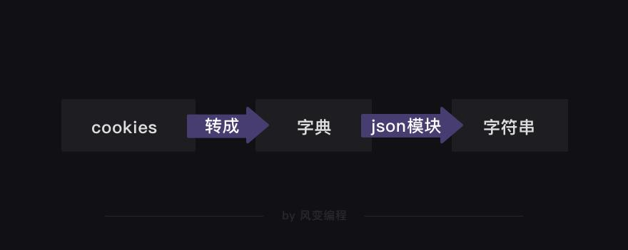

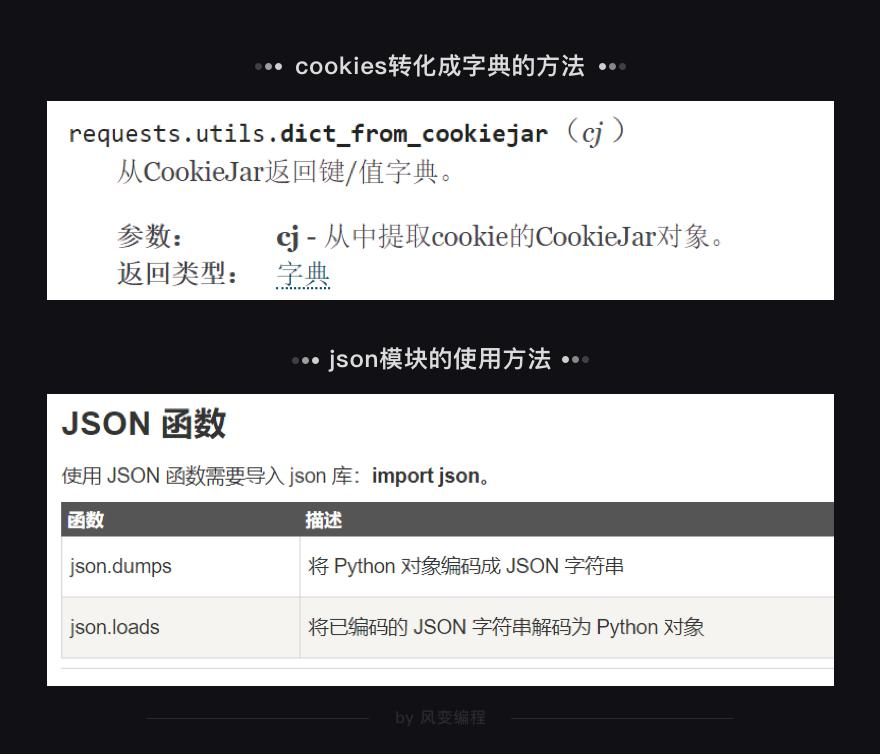

- 把cookies存储成txt文件的代码如下

---
	import requests,json
	引入requests和json模块。
	session = requests.session()   
	url = ' https://wordpress-edu-3autumn.localprod.forc.work/wp-login.php'
	headers = {
	'User-Agent':'Mozilla/5.0 (Windows NT 10.0; WOW64) AppleWebKit/537.36 (KHTML, like Gecko) Chrome/71.0.3578.98 Safari/537.36'
	}
	data = {
	'log': input('请输入你的账号:'),
	'pwd': input('请输入你的密码:'),
	'wp-submit': '登录',
	'redirect_to': 'https://wordpress-edu-3autumn.localprod.forc.work/wp-admin/',
	'testcookie': '1'
	}
	session.post(url, headers=headers, data=data)

	cookies_dict = requests.utils.dict_from_cookiejar(session.cookies)
	把cookies转化成字典。
	print(cookies_dict)
	打印cookies_dict
	cookies_str = json.dumps(cookies_dict)
	调用json模块的dumps函数，把cookies从字典再转成字符串。
	print(cookies_str)
	打印cookies_str
	f = open('cookies.txt', 'w')
	创建名为cookies.txt的文件，以写入模式写入内容。
	f.write(cookies_str)
	把已经转成字符串的cookies写入文件。
	f.close()
	关闭文件。
---

- ookies的存储我们搞定了，但还得搞定cookies的读取，才能解决每次发表评论都得先输入账号密码的问题。

## 读取cookies

- 存储cookies时，是把它先转成字典，再转成字符串。读取cookies则刚好相反，要先把字符串转成字典，再把字典转成cookies本来的格式。

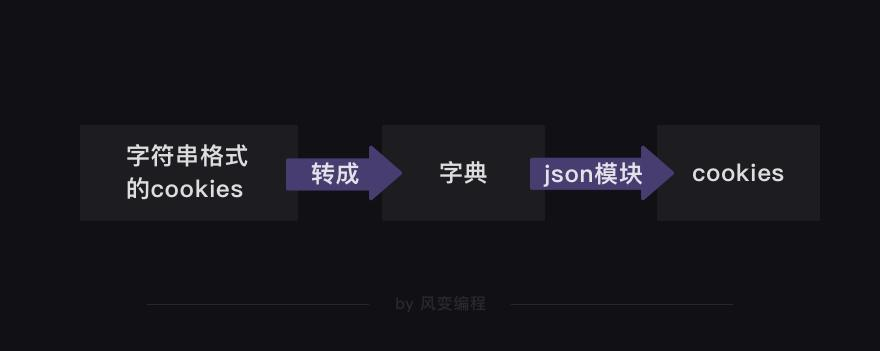

- 读取cookies的代码如下：

---
	cookies_txt = open('cookies.txt', 'r')
	以reader读取模式，打开名为cookies.txt的文件。
	cookies_dict = json.loads(cookies_txt.read())
	调用json模块的loads函数，把字符串转成字典。
	cookies = requests.utils.cookiejar_from_dict(cookies_dict)
	把转成字典的cookies再转成cookies本来的格式。
	session.cookies = cookies
	获取cookies：就是调用requests对象（session）的cookies属性。
---

解决了每一次都要重复输入账号密码的问题，但这个代码还存在一个缺陷——并没有解决cookies会过期的问题。

icon
cookies是否过期，我们可以通过最后的状态码是否等于200来判断。但更好的解决方法应该在代码里加一个条件判断，如果cookies过期，就重新获取新的cookies。

- 更完整以及面向对象的代码应该是下面这样的：

---
	import requests, json
	session = requests.session()
	headers = {
		'User-Agent': 'Mozilla/5.0 (Windows NT 10.0; Win64; x64) AppleWebKit/537.36 (KHTML, like Gecko) Chrome/70.0.3538.110 Safari/537.36'}

	def cookies_read():
		cookies_txt = open('cookies.txt', 'r')
		cookies_dict = json.loads(cookies_txt.read())
		cookies = requests.utils.cookiejar_from_dict(cookies_dict)
		return (cookies)
		以上4行代码，是cookies读取。

	def sign_in():
		url = ' https://wordpress-edu-3autumn.localprod.forc.work/wp-login.php'
		data = {'log': input('请输入你的账号'),
				'pwd': input('请输入你的密码'),
				'wp-submit': '登录',
				'redirect_to': 'https://wordpress-edu-3autumn.localprod.forc.work/wp-admin/',
				'testcookie': '1'}
		session.post(url, headers=headers, data=data)
		cookies_dict = requests.utils.dict_from_cookiejar(session.cookies)
		cookies_str = json.dumps(cookies_dict)
		f = open('cookies.txt', 'w')
		f.write(cookies_str)
		f.close()
		以上5行代码，是cookies存储。

	def write_message():
		url_2 = 'https://wordpress-edu-3autumn.localprod.forc.work/wp-comments-post.php'
		data_2 = {
			'comment': input('请输入你要发表的评论：'),
			'submit': '发表评论',
			'comment_post_ID': '13',
			'comment_parent': '0'
		}
		return (session.post(url_2, headers=headers, data=data_2))
		以上9行代码，是发表评论。

	try:
		session.cookies = cookies_read()
	except FileNotFoundError:
		sign_in()
		session.cookies = cookies_read()

	num = write_message()
	if num.status_code == 200:
		print('成功啦！')
	else:
		sign_in()
		session.cookies = cookies_read()
		num = write_message()

---

	import requests,json
	session = requests.session()
	创建会话。
	headers = {
	'User-Agent': 'Mozilla/5.0 (Windows NT 10.0; Win64; x64) AppleWebKit/537.36 (KHTML, like Gecko) Chrome/70.0.3538.110 Safari/537.36'
	}
	添加请求头，避免被反爬虫。
	try:
	如果能读取到cookies文件，执行以下代码，跳过except的代码，不用登录就能发表评论。
		cookies_txt = open('cookies.txt', 'r')
		以reader读取模式，打开名为cookies.txt的文件。
		cookies_dict = json.loads(cookies_txt.read())
		调用json模块的loads函数，把字符串转成字典。
		cookies = requests.utils.cookiejar_from_dict(cookies_dict)
		把转成字典的cookies再转成cookies本来的格式。
		session.cookies = cookies
		获取会话下的cookies

	except FileNotFoundError:
	如果读取不到cookies文件，程序报“FileNotFoundError”（找不到文件）的错，则执行以下代码，重新登录获取cookies，再评论。

		url = ' https://wordpress-edu-3autumn.localprod.forc.work/wp-login.php'
		登录的网址。
		data = {'log': input('请输入你的账号:'),
				'pwd': input('请输入你的密码:'),
				'wp-submit': '登录',
				'redirect_to': 'https://wordpress-edu-3autumn.localprod.forc.work/wp-admin/',
				'testcookie': '1'}
		登录的参数。
		session.post(url, headers=headers, data=data)
		在会话下，用post发起登录请求。

		cookies_dict = requests.utils.dict_from_cookiejar(session.cookies)
		把cookies转化成字典。
		cookies_str = json.dumps(cookies_dict)
		调用json模块的dump函数，把cookies从字典再转成字符串。
		f = open('cookies.txt', 'w')
		创建名为cookies.txt的文件，以写入模式写入内容
		f.write(cookies_str)
		把已经转成字符串的cookies写入文件
		f.close()
		关闭文件

	url_1 = 'https://wordpress-edu-3autumn.localprod.forc.work/wp-comments-post.php'
	文章的网址。
	data_1 = {
	'comment': input('请输入你想评论的内容：'),
	'submit': '发表评论',
	'comment_post_ID': '13',
	'comment_parent': '0'
	}
	评论的参数。
	session.post(url_1, headers=headers, data=data_1)
	在会话下，用post发起评论请求。
---

## cookies与session
其实，计算机之所以需要cookies和session，是因为HTTP协议是无状态的协议。

何为无状态？就是一旦浏览器和服务器之间的请求和响应完毕后，两者会立马断开连接，也就是恢复成无状态。

这样会导致：服务器永远无法辨认，也记不住用户的信息，像一条只有7秒记忆的金鱼。是cookies和session的出现，才破除了web发展史上的这个难题。

cookies不仅仅能实现自动登录，因为它本身携带了session的编码信息，网站还能根据cookies，记录你的浏览足迹，从而知道你的偏好，只要再加以推荐算法，就可以实现给你推送定制化的内容。

比如，淘宝会根据你搜索和浏览商品的记录，给你推送符合你偏好的商品，增加你的购买率。cookies和session在这其中起到的作用，可谓举足轻重。

