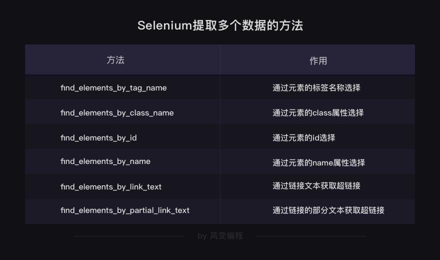
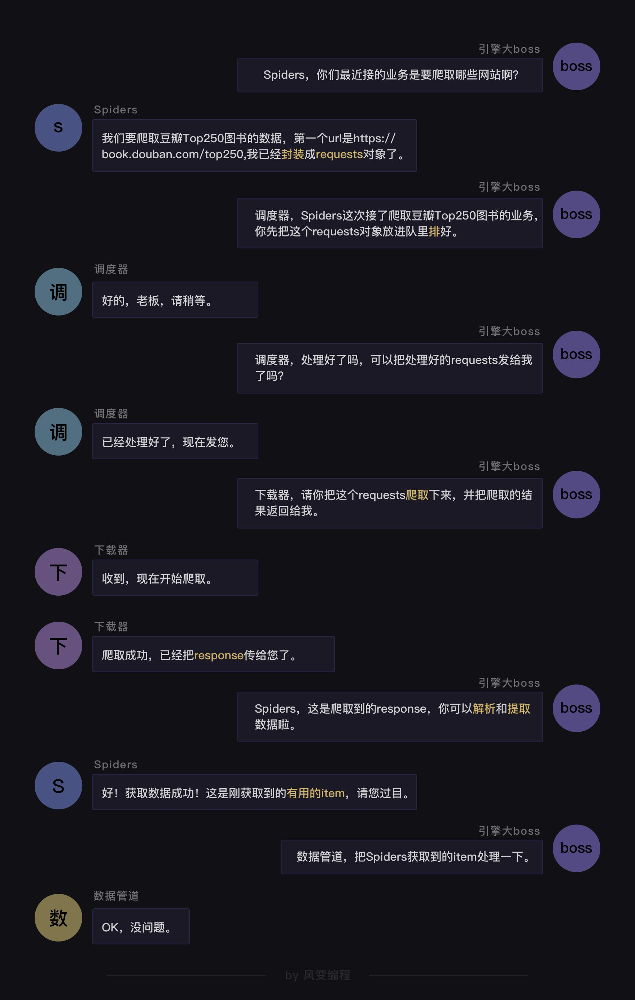
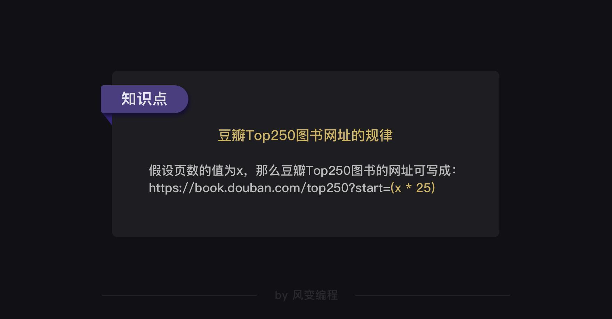
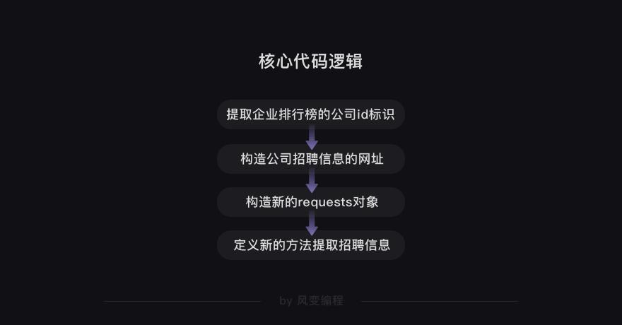

# python crawler

# 目录
- alt+w 查看大纲

---

# 初识爬虫

## 浏览器工作原理

	首先，我们在浏览器输入网址（也可以叫URL）。然后，浏览器向服务器传达了我们想访问某个网页的需求，这个过程就叫做【请求】。
	紧接着，服务器把你想要的网站数据发送给浏览器，这个过程叫做【响应】。
	所以浏览器和服务器之间，先请求，后响应，有这么一层关系。

	当服务器把数据响应给浏览器之后，浏览器并不会直接把数据丢给你。因为这些数据是用计算机的语言写的，浏览器还要把这些数据翻译成你能看得懂的样子，这是浏览器做的另一项工作【解析数据】。
	紧接着，我们就可以在拿到的数据中，挑选出对我们有用的数据，这是【提取数据】。
	最后，我们把这些有用的数据保存好，这是【存储数据】。
	以上，就是浏览器的工作原理，是人、浏览器、服务器三者之间的交流过程。

## 爬虫的工作原理

	当你决定去某个网页后，
	首先，爬虫可以模拟浏览器去向服务器发出请求；
	其次，等服务器响应后，爬虫程序还可以代替浏览器帮我们解析数据；
	接着，爬虫可以根据我们设定的规则批量提取相关数据，而不需要我们去手动提取；
	最后，爬虫可以批量地把数据存储到本地。

	第0步：获取数据。爬虫程序会根据我们提供的网址，向服务器发起请求，然后返回数据。

	第1步：解析数据。爬虫程序会把服务器返回的数据解析成我们能读懂的格式。

	第2步：提取数据。爬虫程序再从中提取出我们需要的数据。

	第3步：储存数据。爬虫程序把这些有用的数据保存起来，便于你日后的使用和分析。

	这就是爬虫的工作原理啦，无论之后的学习内容怎样变化，其核心都是爬虫原理。

## 爬虫学习大纲

## requests

- requests库可以帮我们下载网页源代码、文本、图片，甚至是音频。
- 其实，“下载”本质上是向服务器发送请求并得到响应。

### resquests.get

---
	import requests
	#引入requests库
	res = requests.get('URL')
	#requests.get是在调用requests库中的get()方法，它向服务器发送了一个请求，括号里的参数是你需要的数据所在的网址，然后服务器对请求作出了响应。
	#服务器返回的结果是个Response对象
---

### Response对象的常用属性

  
- res是一个对象，属于requests.models.Response类。

#### response.status_code

  

#### response.content

- 它能把Response对象的内容以二进制数据的形式返回，适用于图片、音频、视频的下载

---
	import requests
	res = requests.get('https://res.pandateacher.com/2018-12-18-10-43-07.png')
	#发出请求，并把返回的结果放在变量res中
	pic=res.content
	#把Reponse对象的内容以二进制数据的形式返回
	photo = open('ppt.jpg','wb')
	#新建了一个文件ppt.jpg，这里的文件没加路径，它会被保存在程序运行的当前目录下。
	#图片内容需要以二进制wb读写。你在学习open()函数时接触过它。
	photo.write(pic) 
	#获取pic的二进制内容
	photo.close()
	#关闭文件
---

#### response.text

- 这个属性可以把Response对象的内容以字符串的形式返回，适用于文字、网页源代码的下载。

---
	import requests
	#引用requests库
	res = requests.get('https://localprod.pandateacher.com/python-manuscript/crawler-html/sanguo.md')
	#下载《三国演义》第一回，我们得到一个对象，它被命名为res
	
	res.encoding='utf-8'
	#定义Reponse对象的编码为utf-8。
	novel=res.text
	#把Response对象的内容以字符串的形式返回
	print(novel[:800])
	#打印小说的前800个字。
	
	k = open('《三国演义》.txt','a+')
	#创建一个名为《三国演义》的txt文档，指针放在文件末尾，追加内容
	k.write(novel)
	#写进文件中     
	k.close()
	#关闭文档
---

#### res.encoding
- 它能定义Response对象的编码类型。

---
	在真实的情况中，我们该在什么时候用res.encoding呢？

	首先，目标数据本身是什么编码是未知的。用requests.get()发送请求后，
	我们会取得一个Response对象，其中，requests库会对数据的编码类型做出自己的判断。
	但是！这个判断有可能准确，也可能不准确。

	如果它判断准确的话，我们打印出来的response.text的内容就是正常的、没有乱码的，
	那就用不到res.encoding；如果判断不准确，就会出现一堆乱码，
	那我们就可以去查看目标数据的编码，然后再用res.encoding把编码定义成和目标数据一致的类型即可。

#### requests总结

## 爬虫伦理

	Robots协议是互联网爬虫的一项公认的道德规范，它的全称是“网络爬虫排除标准”（Robots exclusion protocol），
	这个协议用来告诉爬虫，哪些页面是可以抓取的，哪些不可以。

- 查看网站的robots协议，在网站的域名后加上/robots.txt。
- [淘宝的robots协议](http://www.taobao.com/robots.txt)
- http://www.taobao.com/robots.txt

---
	User-agent:  Baiduspider #百度爬虫
	Allow:  /article #允许访问 /article.htm
	Allow:  /oshtml #允许访问 /oshtml.htm
	Allow:  /ershou #允许访问 /ershou.htm
	Allow: /$ #允许访问根目录，即淘宝主页
	Disallow:  /product/ #禁止访问/product/
	Disallow:  / #禁止访问除 Allow 规定页面之外的其他所有页面
	​
	User-Agent:  Googlebot #谷歌爬虫
	Allow:  /article
	Allow:  /oshtml
	Allow:  /product #允许访问/product/
	Allow:  /spu
	Allow:  /dianpu
	Allow:  /oversea
	Allow:  /list
	Allow:  /ershou
	Allow: /$
	Disallow:  / #禁止访问除 Allow 规定页面之外的其他所有页面
	​
	…… # 文件太长，省略了对其它爬虫的规定，想看全文的话，点击上面的链接
	​
	User-Agent:  * #其他爬虫
	Disallow:  / #禁止访问所有页面
---

- Allow代表可以被访问，Disallow代表禁止被访问。
- 而且有趣的是，淘宝限制了百度对产品页面的爬虫，却允许谷歌访问。

# HTML基础

- HTML（Hyper Text Markup Language）是用来描述网页的一种语言，也叫超文本标记语言 

## 查看网页的HTML代码

- 在网页任意地方点击鼠标右键，然后点击“显示网页源代码”。
- Windows系统的电脑还可以使用快捷键ctrl+u来查看网页源代码。

这样查看的好处是，整个网页的源代码都完整地呈现在你面前。坏处是，在大部分情况下，它都会经过压缩，导致结构不够清晰，你不太容易懂每行代码的含义。而且，源代码和网页分开在两个页面展示。

- 另一种方法：
- 在网页的空白处点击右键，然后选择“检查”（快捷方式是ctrl+shift+i）。
- 开发者工具栏

## HTML的组成

### 标签和元素

- 夹在尖括号<>中间的字母，它们叫做【标签】。
- 标签通常是成对出现的：前面的是【开始标签】，比如<body>；后面的是【结束标签】，如</body>
- 也有标签是形单影只地出现，比如HTML代码的第四行<meta charset="utf-8">（定义网页编码格式为 utf-8）

- 开始标签+结束标签+中间的所有内容，它们在一起就组成了【元素】

- 常见元素  

### 网页头和网页体

	HTML文档的最外层标签一定是<html>，里面嵌套着<head>元素与<body>元素。
	<head>元素代表了【网页头】，<body>元素代表了【网页体】，
	这是最基本的网页结构。
	HTML文档和网页的内容一定是一一对应的。
	只是，【网页头】的内容不会被直接呈现在浏览器里的网页正文中，
	而【网页体】的内容是会直接显示在网页正文中的。

- 网页头

	<head>
		<meta charset="utf-8">  #定义了HTML文档的字符编码
		<title>我是网页的名字</title> #定义网页的标题，这个标题就是显示在浏览器的标签页中的内容
	</head>

### HTML属性

- HTML标签可以通过设置【属性】来为HTML元素描述更多的信息。

	<h1 style="color:#20b2aa;">这个书苑不太冷</h1>

- style属性可以用来定义网页文本的样式，比如字体大小、颜色、间距、对齐方式等等。

	在HTML中，链接一般都由<a>标签定义，href属性用于规定指向页面的URL
	<a href="https://wordpress-edu-3autumn.localprod.forc.work/">我是一个链接，点我试试</a>
	
	
- class属性

---

	

	一个是网页头里的.book；一个是网页体里的
。

	其实.对应class，所以.book代表class book。因此，网页头中的.book和网页体中的class="book"是有联系的。

	在网页头里面，定义了class属性，属性值为"book"，然后下面一长串代码是对这个class属性的描述；接着再在网页体中调用，所以看到了
。

	在HTML中，class属性也可以被多次利用
	网页头的<style>元素中定义了.book的样式，因此，凡是class="book"的元素都会继承它的样式。
	
---
	
- id属性
- 给元素定义id和class的目的都是为了查找、定位元素，或者为元素设置样式
- 但id属性用于标识唯一的元素，而class用于标识一系列的元素。
- id就像是学生的学生证号码，每个人都是唯一的；而学生们可以属于同一个班级，班级就像class

# 爬虫初体验

## BeautifulSoup

- 使用BeautifulSoup解析和提取网页中的数据

### 解析数据

#### BeautifulSoup()

第0个参数是要被解析的文本，注意了，它必须必须必须是字符串。
括号中的第1个参数用来标识解析器，我们要用的是一个Python内置库：html.parser。（它不是唯一的解析器，但是比较简单的）

---
	import requests #调用requests库
	res = requests.get('https://localprod.pandateacher.com/python-manuscript/crawler-html/spider-men5.0.html') 
	#获取网页源代码，得到的res是response对象
	print(res.status_code) #检查请求是否正确响应
	html = res.text #把res的内容以字符串的形式返回
	print(html)#打印html

---

	import requests
	from bs4 import BeautifulSoup
	#引入BS库
	res = requests.get('https://localprod.pandateacher.com/python-manuscript/crawler-html/spider-men5.0.html') 
	html = res.text
	soup = BeautifulSoup(html,'html.parser') #把网页解析为BeautifulSoup对象
	print(type(soup)) #查看soup的类型
	print(soup) # 打印soup

---

	虽然response.text和soup打印出的内容表面上看长得一模一样，却有着不同的内心，
	它们属于不同的类：<class 'str'> 与<class 'bs4.BeautifulSoup'>。
	前者是字符串，后者是已经被解析过的BeautifulSoup对象。
	之所以打印出来的是一样的文本，是因为BeautifulSoup对象在直接打印它的时候会调用该对象内的str方法，所以直接打印 bs 对象显示字符串是str的返回结果

---

### 提取数据

#### find()
- find()与find_all()是BeautifulSoup对象的两个方法

它们可以匹配html的标签和属性，把BeautifulSoup对象里符合要求的数据都提取出来。
它俩的用法基本是一样的，区别在于，find()只提取首个满足要求的数据，而find_all()提取出的是所有满足要求的数据。

---

	items = soup.find_all('div') #用find_all()把所有符合要求的数据提取出来，并放在变量items里
	print(type(items)) #打印items的数据类型
	print(items)       #打印items
	
	打印items的类型，显示的是<class 'bs4.element.ResultSet'>，
	是一个ResultSet类的对象。其实是Tag对象以列表结构储存了起来，可以把它当做列表来处理。
---

#### tag
- Tag对象

---
	for item in items:
    print('想找的数据都包含在这里了：\n',item) # 打印item
    print(type(item))
	
	它们的数据类型是<class 'bs4.element.Tag'>，是Tag对象

- Tag对象可以使用find()与find_all()来继续检索
	
---	

	items = soup.find_all(class_='books') # 通过定位标签和属性提取我们想要的数据
	for item in items:
		kind = item.find('h2') # 在列表中的每个元素里，匹配标签<h2>提取出数据
		title = item.find(class_='title') #在列表中的每个元素里，匹配属性class_='title'提取出数据
		brief = item.find(class_='info') #在列表中的每个元素里，匹配属性class_='info'提取出数据
		print(kind,'\n',title,'\n',brief) # 打印提取出的数据
		print(type(kind),type(title),type(brief)) # 打印提取出的数据类型

---
- 完整代码

---
	import requests # 调用requests库
	from bs4 import BeautifulSoup # 调用BeautifulSoup库
	res =requests.get('https://localprod.pandateacher.com/python-manuscript/crawler-html/spider-men5.0.html')
	
	html=res.text
	
	soup = BeautifulSoup( html,'html.parser')
	
	items = soup.find_all(class_='books')   # 通过匹配属性class='books'提取出我们想要的元素
	for item in items:                      # 遍历列表items
		kind = item.find('h2')               # 在列表中的每个元素里，匹配标签<h2>提取出数据
		title = item.find(class_='title')     #  在列表中的每个元素里，匹配属性class_='title'提取出数据
		brief = item.find(class_='info')      # 在列表中的每个元素里，匹配属性class_='info'提取出数据
		print(kind.text,'\n',title.text,'\n',title['href'],'\n',brief.text) # 打印书籍的类型、名字、链接和简介的文字

---

## 对象的变化过程

我们的操作对象是这样的：Response对象——字符串——BS对象。
到这里，又产生了两条分岔：一条是BS对象——Tag对象；
另一条是BS对象——列表——Tag对象。

# 下厨房项目

- 先提取每个菜的全部信息，然后写循环，一个一个信息提取
---
	import requests
	from bs4 import BeautifulSoup
	

	res_foods = requests.get('http://www.xiachufang.com/explore/') # 获取数据
	
	bs_foods = BeautifulSoup(res_foods.text,'html.parser') # 解析数据
	list_foods = bs_foods.find_all('div',class_='info pure-u') # 查找最小父级标签

	list_all = [] # 创建一个空列表，用于存储信息

	for food in list_foods:

		tag_a = food.find('a') # 提取第0个父级标签中的<a>标签
		name = tag_a.text[17:-13] # 菜名，使用[17:-13]切掉了多余的信息
		URL = 'http://www.xiachufang.com'+tag_a['href'] # 获取URL
		tag_p = food.find('p',class_='ing ellipsis') # 提取第0个父级标签中的
标签
		ingredients = tag_p.text[1:-1] # 食材，使用[1:-1]切掉了多余的信息
		list_all.append([name,URL,ingredients]) # 将菜名、URL、食材，封装为列表，添加进list_all

	print(list_all) # 打印
	
---	

- 分别提取所有的菜名、所有的URL、所有的食材。然后让菜名、URL、食材给一一对应起来。

---
	import requests # 引用requests库
	from bs4 import BeautifulSoup # 引用BeautifulSoup库

	res_foods = requests.get('http://www.xiachufang.com/explore/') # 获取数据
	bs_foods = BeautifulSoup(res_foods.text,'html.parser') # 解析数据

	tag_name = bs_foods.find_all('p',class_='name') # 查找包含菜名和URL的
标签
	tag_ingredients = bs_foods.find_all('p',class_='ing ellipsis') # 查找包含食材的
标签
	list_all = [] # 创建一个空列表，用于存储信息
	for x in range(len(tag_name)): # 启动一个循环，次数等于菜名的数量
		list_food = [tag_name[x].text[18:-14],tag_name[x].find('a')['href'],tag_ingredients[x].text[1:-1]] 
		提取信息，封装为列表。注意此处[18:-14]切片和之前不同，是因为此处使用的是
标签，而之前是<a>
		list_all.append(list_food) # 将信息添加进list_all
	print(list_all # 打印

---

# 歌单项目

- 网页源代码里没有我们想要的数据,怎么解决？

## Network

- Network的功能是：记录在当前页面上发生的所有请求。

- [周杰伦歌单](https://y.qq.com/portal/search.html#page=1&searchid=1&remoteplace=txt.yqq.top&t=song&w=%E5%91%A8%E6%9D%B0%E4%BC%A6)  

	在图最下面，它告诉我们：此处共有52个请求，36.9kb的流量，耗时2.73s完成。
这个，正是我们的浏览器每时每刻工作的真相：它总是在向服务器，发起各式各样的请求。当这些请求完成，它们会一起组成我们在Elements中看到的网页源代码。
	为什么我们刚才没办法拿到歌曲清单呢？答，这是因为我们刚刚写的代码，只是模拟了这52个请求中的一个（准确来说，就是第0个请求），而这个请求里并不包含歌曲清单。

- 找到这个页面的第0个请求：search.html
- 查看它的Response（官方翻译叫“响应”，你可以理解为服务器对浏览器这个请求的回应内容，即请求的结果）
- 它就是我们刚刚用requests.get()获取到的网页源代码，它里面不包含歌曲清单。

	一般来说，都是这种第0个请求先启动了，其他的请求才会关联启动，一点点地将网页给填充起来。做一个比喻，第0个请求就好比是人的骨架，确定了这个网页的结构。在此之后，众多的请求接连涌入，作为人的血脉经络。
也有一些网页，直接把所有的关键信息都放在第0个请求里，尤其是一些比较老（或比较轻量）的网站，我们用requests和BeautifulSoup就能解决它们。

#### Network用法

	第0行的左侧，红色的圆钮是启用Network监控（默认高亮打开），灰色圆圈是清空面板上的信息。右侧勾选框Preserve log，它的作用是“保留请求日志”。如果不点击这个，当发生页面跳转的时候，记录就会被清空。所以，我们在爬取一些会发生跳转的网页时，会点亮它。
	第1行，是对请求进行分类查看。我们最常用的是：ALL（查看全部）/XHR（仅查看XHR，我们等会重点讲它）/Doc（Document，第0个请求一般在这里），有时候也会看看：Img（仅查看图片）/Media（仅查看媒体文件）/Other（其他）。最后，JS和CSS，则是前端代码，负责发起请求和页面实现；Font是文字的字体；而理解WS和Manifest，需要网络编程的知识

夹在第2行和第1行中间的，是一个时间轴。记录什么时间，有哪些请求。而第2行，就是各个请求

#### XHR

Network中，有一类非常重要的请求叫做XHR（当你把鼠标在XHR上悬停，你可以看到它的完整表述是XHR and Fetch）

我们平时使用浏览器上网的时候，经常有这样的情况：浏览器上方，它所访问的网址没变，但是网页里却新加了内容。

典型代表：如购物网站，下滑自动加载出更多商品。在线翻译网站，输入中文实时变英文。比如，你正在使用的教学系统，每点击一次Enter就有新的内容弹出。

这个，叫做Ajax技术（技术本身和爬虫关系不大，在此不做展开，你可以通过搜索了解）。应用这种技术，好处是显而易见的——更新网页内容，而不用重新加载整个网页。又省流量又省时间的。

如今，比较新潮的网站都在使用这种技术来实现数据传输。只剩下一些特别老，或是特别轻量的网站，还在用老办法——加载新的内容，必须要跳转一个新网址。

这种技术在工作的时候，会创建一个XHR（或是Fetch）对象，然后利用XHR对象来实现，服务器和浏览器之间传输数据。在这里，XHR和Fetch并没有本质区别，只是Fetch出现得比XHR更晚一些，所以对一些开发人员来说会更好用，但作用都是一样的。

- 我们的歌曲清单不在网页源代码里，而且也不是图片，不是媒体文件，自然只会是在XHR里
- 点击查看XHR

从左往右分别是：Headers：标头（请求信息）、Preview：预览、Response：原始信息、Timing：时间。

- 点击Preview，你能在里面发现我们想要的信息：歌名就藏在里面！
- 那如何把这些歌曲名拿到呢？这就需要我们去看看最左侧的Headers

- General里的Requests URL就是我们应该去访问的链接

	import requests # 引用requests库
	res = requests.get('https://c.y.qq.com/soso/fcgi-bin/client_search_cp?ct=24&qqmusic_ver=1298&new_json=1&remoteplace=txt.yqq.song&searchid=60997426243444153&t=0&aggr=1&cr=1&catZhida=1&lossless=0&flag_qc=0&p=1&n=20&w=%E5%91%A8%E6%9D%B0%E4%BC%A6&g_tk=5381&loginUin=0&hostUin=0&format=json&inCharset=utf8&outCharset=utf-8&notice=0&platform=yqq.json&needNewCode=0')
	调用get方法，下载这个字典
	print(res.text)
	把它打印出来
	
	
- 使用res.text取到的，是字符串。它不是我们想要的列表/字典，数据取不出来。

#### json

- 在Python语言当中，json是一种特殊的字符串，这种字符串特殊在它的写法——它是用列表/字典的语法写成的

	a = '1,2,3,4'
	 这是字符串
	b = [1,2,3,4]
	 这是列表
	c = '[1,2,3,4]'
	 这是字符串，但它是用json格式写的字符串

- 组织数据的方式也有规律，规律有三条：

json则是另一种组织数据的格式，长得和Python中的列表/字典非常相像。它和html一样，常用来做网络数据传输。刚刚我们在XHR里查看到的列表/字典，严格来说其实它不是列表/字典，它是json。

为什么要把它表示成字符串？答案很简单，因为不是所有的编程语言都能读懂Python里的数据类型（如，列表/字符串），但是所有的编程语言，都支持文本（比如在Python中，用字符串这种数据类型来表示文本）这种最朴素的数据类型。

如此，json数据才能实现，跨平台，跨语言工作。

而json和XHR之间的关系：XHR用于传输数据，它能传输很多种数据，json是被传输的一种数据格式。

我们总是可以将json格式的数据，转换成正常的列表/字典，也可以将列表/字典，转换成json。

#### 解析json

- 查看requests库处理json数据的方法

---
	import requests
	 引用requests库
	res_music = requests.get('https://c.y.qq.com/soso/fcgi-bin/client_search_cp?ct=24&qqmusic_ver=1298&new_json=1&remoteplace=txt.yqq.song&searchid=60997426243444153&t=0&aggr=1&cr=1&catZhida=1&lossless=0&flag_qc=0&p=1&n=20&w=%E5%91%A8%E6%9D%B0%E4%BC%A6&g_tk=5381&loginUin=0&hostUin=0&format=json&inCharset=utf8&outCharset=utf-8&notice=0&platform=yqq.json&needNewCode=0')
	 调用get方法，下载这个字典
	json_music = res_music.json()
	 使用json()方法，将response对象，转为列表/字典
	list_music = json_music['data']['song']['list']
	 一层一层地取字典，获取歌单列表
	for music in list_music:
	 list_music是一个列表，music是它里面的元素
		print(music['name'])
		 以name为键，查找歌曲名
		print('所属专辑：'+music['album']['name'])
		 查找专辑名
		print('播放时长：'+str(music['interval'])+'秒')
		 查找播放时长
		print('播放链接：https://y.qq.com/n/yqq/song/'+music['mid']+'.html\n\n')
		 查找播放链接

---

# 歌曲评论项目

## 利用XHR找数据

- 学会如何判断我们想要的信息是在Html，还是在XHR里：

## 带参数请求数据

读懂参数，有两个重要的方法是“观察”和“比较”。
“观察”指的是阅读参数的键与值，尝试理解它的含义。“比较”指的是比较两个相近的XHR——它们有哪些不同，对应的页面显示内容有什么不同。

---
	import requests
	 引用requests模块
	for i in range(5):
		res_comments = requests.get('https://c.y.qq.com/base/fcgi-bin/fcg_global_comment_h5.fcg?g_tk=5381&loginUin=0&hostUin=0&format=json&inCharset=utf8&outCharset=GB2312&notice=0&platform=yqq.json&needNewCode=0&cid=205360772&reqtype=2&biztype=1&topid=102065756&cmd=6&needmusiccrit=0&pagenum='+str(i)+'&pagesize=15&lasthotcommentid=song_102065756_3202544866_44059185&domain=qq.com&ct=24&cv=10101010')
		 调用get方法，下载评论列表
		json_comments = res_comments.json()
		 使用json()方法，将response对象，转为列表/字典
		list_comments = json_comments['comment']['commentlist']
		 一层一层地取字典，获取评论列表
		for comment in list_comments:
		 list_comments是一个列表，comment是它里面的元素
			print(comment['rootcommentcontent'])
			 输出评论
			print('-----------------------------------')
			 将不同的评论分隔开来

---

我们来让这个代码变好看些。事实上，requests模块里的requests.get()提供了一个参数叫params，可以让我们用字典的形式，把参数传进去。

所以，其实我们可以把Query String Parametres里的内容，直接复制下来，封装为一个字典，传递给params。只是有一点要特别注意：要给他们打引号，让它们变字符串。

---
	import requests
	 引用requests模块
	url = 'https://c.y.qq.com/base/fcgi-bin/fcg_global_comment_h5.fcg'
	 请求歌曲评论的url参数的前面部分

	for i in range(5):
		params = {
		'g_tk':'5381',
		'loginUin':'0', 
		'hostUin':'0',
		'format':'json',
		'inCharset':'utf8',
		'outCharset':'GB2312',
		'notice':'0',
		'platform':'yqq.json',
		'needNewCode':'0',
		'cid':'205360772',
		'reqtype':'2',
		'biztype':'1',
		'topid':'102065756',
		'cmd':'6',
		'needmusiccrit':'0',
		'pagenum':str(i),
		'pagesize':'15',
		'lasthotcommentid':'song_102065756_3202544866_44059185',
		'domain':'qq.com',
		'ct':'24',
		'cv':'10101010'   
		}
		 将参数封装为字典
		res_comments = requests.get(url,params=params)
		 调用get方法，下载这个字典
		json_comments = res_comments.json()
		list_comments = json_comments['comment']['commentlist']
		for comment in list_comments:
			print(comment['rootcommentcontent'])
			print('-----------------------------------')

---

## Request Headers
- 服务器怎么判断访问者是一个普通的用户（通过浏览器），还是一个爬虫者（通过代码）

Requests Headers，我们把它称作请求头。它里面会有一些关于该请求的基本信息，比如：这个请求是从什么设备什么浏览器上发出？这个请求是从哪个页面跳转而来？
user-agent（中文：用户代理）会记录你电脑的信息和浏览器版本（如我的，就是windows10的64位操作系统，使用谷歌浏览器）
origin（中文：源头）和referer（中文：引用来源）则记录了这个请求，最初的起源是来自哪个页面。它们的区别是referer会比origin携带的信息更多些。
如果我们想告知服务器，我们不是爬虫是一个正常的浏览器，就要去修改user-agent。倘若不修改，那么这里的默认值就会是Python，会被浏览器认出来。

### 添加Requests Headers

---
	import requests
	url = 'https://c.y.qq.com/soso/fcgi-bin/client_search_cp'

	headers = {
		'origin':'https://y.qq.com',
		 请求来源，本案例中其实是不需要加这个参数的，只是为了演示
		'referer':'https://y.qq.com/n/yqq/song/004Z8Ihr0JIu5s.html',
		 请求来源，携带的信息比“origin”更丰富，本案例中其实是不需要加这个参数的，只是为了演示
		'user-agent':'Mozilla/5.0 (Windows NT 10.0; Win64; x64) AppleWebKit/537.36 (KHTML, like Gecko) Chrome/71.0.3578.98 Safari/537.36',
		 标记了请求从什么设备，什么浏览器上发出
		}
	 伪装请求头

	params = {
	'ct':'24',
	'qqmusic_ver': '1298',
	'new_json':'1',
	'remoteplace':'sizer.yqq.song_next',
	'searchid':'64405487069162918',
	't':'0',
	'aggr':'1',
	'cr':'1',
	'catZhida':'1',
	'lossless':'0',
	'flag_qc':'0',
	'p':1,
	'n':'20',
	'w':'周杰伦',
	'g_tk':'5381',
	'loginUin':'0',
	'hostUin':'0',
	'format':'json',
	'inCharset':'utf8',
	'outCharset':'utf-8',
	'notice':'0',
	'platform':'yqq.json',
	'needNewCode':'0'    
	}
	 将参数封装为字典
	res_music = requests.get(url,headers=headers,params=params)
	 发起请求，填入请求头和参数

---

一个url由两部分组成，?（有时候是“#”）之前是我们请求的地址，?之后是我们的请求所附带的参数。通常，我们会把参数封装成一个字典，添加进请求中去。

# 数据存储

## 存储数据的方式
- 常用的存储数据的方式有两种——存储成csv格式文件、存储成Excel文件

csv是一种字符串文件的格式，它组织数据的语法就是在字符串之间加分隔符——行与行之间是加换行符，同列之间是加逗号分隔。

它可以用任意的文本编辑器打开（如记事本），也可以用Excel打开，还可以通过Excel把文件另存为csv格式（因为Excel支持csv格式文件）。

## 存储数据的基础知识

- 操作csv文件我们需要借助csv模块；操作Excel文件则需要借助openpyxl模块。

### csv写入与读取

	import csv
	引用csv模块。
	csv_file = open('demo.csv','w',newline='',encoding='utf-8')
	创建csv文件，我们要先调用open()函数，传入参数：文件名“demo.csv”、写入模式“w”、newline=''、encoding='utf-8'。

加newline=' '参数的原因是，可以避免csv文件出现两倍的行距（就是能避免表格的行与行之间出现空白行）。加encoding='utf-8'，可以避免编码问题导致的报错或乱码。

创建完csv文件后，我们要借助csv.writer()函数来建立一个writer对象。
用writer对象的writerow()方法，往csv文件里写入新的内容。
writerow()函数里，需要放入列表参数，所以我们得把要写入的内容写成列表。就像['电影','豆瓣评分']。

---
	import csv
	引用csv模块。
	csv_file = open('demo.csv','w',newline='',encoding='utf-8')
	调用open()函数打开csv文件，传入参数：文件名“demo.csv”、写入模式“w”、newline=''、encoding='utf-8'。
	writer = csv.writer(csv_file)
	 用csv.writer()函数创建一个writer对象。
	writer.writerow(['电影','豆瓣评分'])
	调用writer对象的writerow()方法，可以在csv文件里写入一行文字 “电影”和“豆瓣评分”。
	writer.writerow(['银河护卫队','8.0'])
	在csv文件里写入一行文字 “银河护卫队”和“8.0”。
	writer.writerow(['复仇者联盟','8.1'])
	在csv文件里写入一行文字 “复仇者联盟”和“8.1”。
	csv_file.close()
	写入完成后，关闭文件就大功告成啦！
---

- [csv模块官方文档链接](https://yiyibooks.cn/xx/python_352/library/csv.html#module-csv)

### Excel写入与读取

一个Excel文档也称为一个工作薄（workbook），每个工作薄里可以有多个工作表（wordsheet），当前打开的工作表又叫活动表。

---
	import openpyxl 
	引用openpyxl。
	wb = openpyxl.Workbook()
	利用openpyxl.Workbook()函数创建新的workbook（工作薄）对象，就是创建新的空的Excel文件。
	
	创建完新的工作薄后，还得获取工作表。不然程序会懵逼，不知道要把内容写入哪张工作表里。
	sheet = wb.active
	wb.active
	就是获取这个工作薄的活动表，通常就是第一个工作表。
	sheet.title = 'new title'
	可以用.title给工作表重命名。现在第一个工作表的名称就会由原来默认的“sheet1”改为"new title"。

	添加完工作表，我们就能来操作单元格，往单元格里写入内容。
	heet['A1'] = '漫威宇宙' 
	把'漫威宇宙'赋值给第一个工作表的A1单元格，就是往A1的单元格中写入了'漫威宇宙'。

	往工作表里写入一行内容的话，就得用到append函数
	row = ['美国队长','钢铁侠','蜘蛛侠']
	把我们想写入的一行内容写成列表，赋值给row。
	sheet.append(row)
	用sheet.append()就能往表格里添加这一行文字。

	wb.save('Marvel.xlsx')
	保存新建的Excel文件，并命名为“Marvel.xlsx”
	
	读取的代码：
	wb = openpyxl.load_workbook('Marvel.xlsx')
	sheet = wb['new title']
	sheetname = wb.sheetnames
	print(sheetname)
	A1_cell = sheet['A1']
	A1_value = A1_cell.value
	print(A1_value)
---

- [openpyxl模块的官方文档](https://openpyxl.readthedocs.io/en/stable/)

# 爬取知乎大v张佳玮的文章

## 复习

从Response对象开始，我们就分成了两条路径，一条路径是数据放在HTML里，所以我们用BeautifulSoup库去解析数据和提取数据；另一条，数据作为Json存储起来，所以我们用response.json()方法去解析，然后提取、存储数据。

---
	import requests
	import csv
	引用csv。
	csv_file=open('articles.csv','w',newline='',encoding='utf-8')
	调用open()函数打开csv文件，传入参数：文件名“articles.csv”、写入模式“w”、newline=''。
	writer = csv.writer(csv_file)
	 用csv.writer()函数创建一个writer对象。
	list2=['标题','链接','摘要']
	创建一个列表
	writer.writerow(list2)
	调用writer对象的writerow()方法，可以在csv文件里写入一行文字 “标题”和“链接”和"摘要"。
	
	headers={'user-agent':'Mozilla/5.0 (Macintosh; Intel Mac OS X 10_13_6) AppleWebKit/537.36 (KHTML, like Gecko) Chrome/71.0.3578.98 Safari/537.36'}
	url='https://www.zhihu.com/api/v4/members/zhang-jia-wei/articles?'
	articlelist=[]
	建立一个空列表，以待写入数据
	offset=0
	设置offset的起始值为0
	
	while True:
		params={
			'include':'data[*].comment_count,suggest_edit,is_normal,thumbnail_extra_info,thumbnail,can_comment,comment_permission,admin_closed_comment,content,voteup_count,created,updated,upvoted_followees,voting,review_info,is_labeled,label_info;data[*].author.badge[?(type=best_answerer)].topics',
			'offset':str(offset),
			'limit':'20',
			'sort_by':'voteups',
			}
		封装参数
		res=requests.get(url,headers=headers,params=params)
		发送请求，并把响应内容赋值到变量res里面
		articles=res.json()
		 print(articles)
		data=articles['data']
		定位数据
		for i in data:
			list1=[i['title'],i['url'],i['excerpt']]
			#把数据封装成列表
			articlelist.append(list1)
			writer.writerow(list1)
        调用writerow()方法，把列表list1的内容写入
		offset=offset+20
		在while循环内部，offset的值每次增加20
		if offset>40:
			break
		如果offset大于40，即爬了两页，就停止
		if articles['paging']['is_end'] == True:
		如果键is_end所对应的值是True，就结束while循环。
			break
	print(articlelist)
	打印看看
	
	csv_file.close()
	写入完成后，关闭文件就大功告成
---

# cookies

## post请求

- [蜘蛛侠网站](https://wordpress-edu-3autumn.localprod.forc.work/wp-login.php)
- 账号：spiderman，密码：crawler334566

上图左边是“正常人”的操作：填上账号和密码；右边我们可以用工程师的思维，来分析浏览器的登录请求是怎么发送的。你需要做的是：先正常操作——填写完账号密码（别点击登录），再用工程师的做法操作：右击打开“检查”工具，点击【network】，勾选【preserve log】（持续显示请求记录，防止请求记录被刷新）。

展开第0个请求【wp-login.php】，浏览一下【headers】。在【General】键里，我们可以先只看前两个参数【Request URL】（请求网址）和【Request Method】（请求方式）。

这里的请求方式是post，而不是我们之前学过的get。

## post与get区别

- 其实，post和get都可以带着参数请求，不过get请求的参数会在url上显示出来。

但post请求的参数就不会直接显示，而是隐藏起来。像账号密码这种私密的信息，就应该用post的请求。如果用get请求的话，账号密码全部会显示在网址上，这显然不科学！你可以这么理解，get是明文显示，post是非明文显示。

通常，get请求会应用于获取网页数据，比如我们之前学的requests.get()。post请求则应用于向网页提交数据，比如提交表单类型数据（像账号密码就是网页表单的数据）。

get和post是两种最常用的请求方式，除此之外，还有其他类型的请求方式，如head、options等

【requests headers】存储的是浏览器的请求信息，【response headers】存储的是服务器的响应信息。我们这一关要找的cookies就在其中。

你会看到在【response headers】里有set cookies的参数。set cookies是什么意思？就是服务器往浏览器写入了cookies。

## cookies及其用法

当你登录博客账号spiderman，并勾选“记住我”，服务器就会生成一个cookies和spiderman这个账号绑定。接着，它把这个cookies告诉你的浏览器，让浏览器把cookies存储到你的本地电脑。当下一次，浏览器带着cookies访问博客，服务器会知道你是spiderman，你不需要再重复输入账号密码，即可直接访问。

当然，cookies也是有时效性的，过期后就会失效。你应该有过这样的体验：哪怕勾选了“记住我”，但一段时间过去了，网站还是会提示你要重新登录，就是之前的cookies已经失效。

---
	import requests
	引入requests。
	url = ' https://wordpress-edu-3autumn.localprod.forc.work/wp-login.php'
	把请求登录的网址赋值给url。
	headers = {
	'User-Agent':'Mozilla/5.0 (Windows NT 10.0; Win64; x64) AppleWebKit/537.36 (KHTML, like Gecko) Chrome/70.0.3538.110 Safari/537.36'
	}
	加请求头，前面有说过加请求头是为了模拟浏览器正常的访问，避免被反爬虫。
	data = {
	'log': 'spiderman',  #写入账户
	'pwd': 'crawler334566',  #写入密码
	'wp-submit': '登录',
	'redirect_to': 'https://wordpress-edu-3autumn.localprod.forc.work/wp-admin/',
	'testcookie': '1'
	}
	把有关登录的参数封装成字典，赋值给data。
	login_in = requests.post(url,headers=headers,data=data)
	用requests.post发起请求，放入参数：请求登录的网址、请求头和登录参数，然后赋值给login_in。
	cookies = login_in.cookies
	提取cookies的方法：调用requests对象（login_in）的cookies属性获得登录的cookies，并赋值给变量cookies。

	url_1 = 'https://wordpress-edu-3autumn.localprod.forc.work/wp-comments-post.php'
	我们想要评论的文章网址。
	data_1 = {
	'comment': input('请输入你想要发表的评论：'),
	'submit': '发表评论',
	'comment_post_ID': '13',
	'comment_parent': '0'
	}
	把有关评论的参数封装成字典。
	comment = requests.post(url_1,headers=headers,data=data_1,cookies=cookies)
	用requests.post发起发表评论的请求，放入参数：文章网址、headers、评论参数、cookies参数，赋值给comment。
	调用cookies的方法就是在post请求中传入cookies=cookies的参数。
	print(comment.status_code)
	打印出comment的状态码，若状态码等于200，则证明我们评论成功。

---

## session及其用法

所谓的会话，你可以理解成我们用浏览器上网，到关闭浏览器的这一过程。session是会话过程中，服务器用来记录特定用户会话的信息。

比如你打开浏览器逛购物网页的整个过程中，浏览了哪些商品，在购物车里放了多少件物品，这些记录都会被服务器保存在session中。

- session和cookies的关系还非常密切——cookies中存储着session的编码信息，session中又存储了cookies的信息。

当浏览器第一次访问购物网页时，服务器会返回set cookies的字段给浏览器，而浏览器会把cookies保存到本地。

等浏览器第二次访问这个购物网页时，就会带着cookies去请求，而因为cookies里带有会话的编码信息，服务器立马就能辨认出这个用户，同时返回和这个用户相关的特定编码的session。

这也是为什么你每次重新登录购物网站后，你之前在购物车放入的商品并不会消失的原因。因为你在登录时，服务器可以通过浏览器携带的cookies，找到保存了你购物车信息的session。

---
	- 创建session来处理cookies。

	

	---
	import requests
	引用requests。
	session = requests.session()
	用requests.session()创建session对象，相当于创建了一个特定的会话，帮我们自动保持了cookies。
	url = 'https://wordpress-edu-3autumn.localprod.forc.work/wp-login.php'
	headers = {
	'User-Agent':'Mozilla/5.0 (Windows NT 10.0; WOW64) AppleWebKit/537.36 (KHTML, like Gecko) Chrome/71.0.3578.98 Safari/537.36'
	}
	data = {
		'log':input('请输入账号：'), #用input函数填写账号和密码，这样代码更优雅，而不是直接把账号密码填上去。
		'pwd':input('请输入密码：'),
		'wp-submit':'登录',
		'redirect_to':'https://wordpress-edu-3autumn.localprod.forc.work/wp-admin/',
		'testcookie':'1'
	}
	session.post(url,headers=headers,data=data)
	在创建的session下用post发起登录请求，放入参数：请求登录的网址、请求头和登录参数。

	url_1 = 'https://wordpress-edu-3autumn.localprod.forc.work/wp-comments-post.php'
	把我们想要评论的文章网址赋值给url_1。
	data_1 = {
	'comment': input('请输入你想要发表的评论：'),
	'submit': '发表评论',
	'comment_post_ID': '13',
	'comment_parent': '0'
	}
	把有关评论的参数封装成字典。
	comment = session.post(url_1,headers=headers,data=data_1)
	在创建的session下用post发起评论请求，放入参数：文章网址，请求头和评论参数，并赋值给comment。
	print(comment)
打印comment

---

## 存储cookies

cookies能帮我们保存登录的状态，那我们就在第一次登录时把cookies存储下来，等下次登录再把存储的cookies读取出来，这样就不用重复输入账号密码了。

---
	import requests
	session = requests.session()
	url = 'https://wordpress-edu-3autumn.localprod.forc.work/wp-login.php'
	headers = {
	'User-Agent':'Mozilla/5.0 (Windows NT 10.0; WOW64) AppleWebKit/537.36 (KHTML, like Gecko) Chrome/71.0.3578.98 Safari/537.36'
	}
	data = {
		'log':input('请输入账号：'),
		'pwd':input('请输入密码：'),
		'wp-submit':'登录',
		'redirect_to':'https://wordpress-edu-3autumn.localprod.forc.work/wp-admin/',
		'testcookie':'1'
	}
	session.post(url,headers=headers,data=data)
	print(type(session.cookies))
	打印cookies的类型,session.cookies就是登录的cookies
	print(session.cookies)
	打印cookies
---

RequestsCookieJar是cookies对象的类，cookies本身的内容有点像一个列表，里面又有点像字典的键与值

json模块能把字典转成字符串。我们或许可以先把cookies转成字典，然后再通过json模块转成字符串。这样，就能用open函数把cookies存储成txt文件。

- 把cookies存储成txt文件的代码如下

---
	import requests,json
	引入requests和json模块。
	session = requests.session()   
	url = ' https://wordpress-edu-3autumn.localprod.forc.work/wp-login.php'
	headers = {
	'User-Agent':'Mozilla/5.0 (Windows NT 10.0; WOW64) AppleWebKit/537.36 (KHTML, like Gecko) Chrome/71.0.3578.98 Safari/537.36'
	}
	data = {
	'log': input('请输入你的账号:'),
	'pwd': input('请输入你的密码:'),
	'wp-submit': '登录',
	'redirect_to': 'https://wordpress-edu-3autumn.localprod.forc.work/wp-admin/',
	'testcookie': '1'
	}
	session.post(url, headers=headers, data=data)

	cookies_dict = requests.utils.dict_from_cookiejar(session.cookies)
	把cookies转化成字典。
	print(cookies_dict)
	打印cookies_dict
	cookies_str = json.dumps(cookies_dict)
	调用json模块的dumps函数，把cookies从字典再转成字符串。
	print(cookies_str)
	打印cookies_str
	f = open('cookies.txt', 'w')
	创建名为cookies.txt的文件，以写入模式写入内容。
	f.write(cookies_str)
	把已经转成字符串的cookies写入文件。
	f.close()
	关闭文件。
---

- cookies的存储我们搞定了，但还得搞定cookies的读取，才能解决每次发表评论都得先输入账号密码的问题。

## 读取cookies

- 存储cookies时，是把它先转成字典，再转成字符串。读取cookies则刚好相反，要先把字符串转成字典，再把字典转成cookies本来的格式。

- 读取cookies的代码如下：

---
	cookies_txt = open('cookies.txt', 'r')
	以reader读取模式，打开名为cookies.txt的文件。
	cookies_dict = json.loads(cookies_txt.read())
	调用json模块的loads函数，把字符串转成字典。
	cookies = requests.utils.cookiejar_from_dict(cookies_dict)
	把转成字典的cookies再转成cookies本来的格式。
	session.cookies = cookies
	获取cookies：就是调用requests对象（session）的cookies属性。
---

解决了每一次都要重复输入账号密码的问题，但这个代码还存在一个缺陷——并没有解决cookies会过期的问题。

icon
cookies是否过期，我们可以通过最后的状态码是否等于200来判断。但更好的解决方法应该在代码里加一个条件判断，如果cookies过期，就重新获取新的cookies。

- 更完整以及面向对象的代码应该是下面这样的：

---
	import requests, json
	session = requests.session()
	headers = {
		'User-Agent': 'Mozilla/5.0 (Windows NT 10.0; Win64; x64) AppleWebKit/537.36 (KHTML, like Gecko) Chrome/70.0.3538.110 Safari/537.36'}

	def cookies_read():
		cookies_txt = open('cookies.txt', 'r')
		cookies_dict = json.loads(cookies_txt.read())
		cookies = requests.utils.cookiejar_from_dict(cookies_dict)
		return (cookies)
		以上4行代码，是cookies读取。

	def sign_in():
		url = ' https://wordpress-edu-3autumn.localprod.forc.work/wp-login.php'
		data = {'log': input('请输入你的账号'),
				'pwd': input('请输入你的密码'),
				'wp-submit': '登录',
				'redirect_to': 'https://wordpress-edu-3autumn.localprod.forc.work/wp-admin/',
				'testcookie': '1'}
		session.post(url, headers=headers, data=data)
		cookies_dict = requests.utils.dict_from_cookiejar(session.cookies)
		cookies_str = json.dumps(cookies_dict)
		f = open('cookies.txt', 'w')
		f.write(cookies_str)
		f.close()
		以上5行代码，是cookies存储。

	def write_message():
		url_2 = 'https://wordpress-edu-3autumn.localprod.forc.work/wp-comments-post.php'
		data_2 = {
			'comment': input('请输入你要发表的评论：'),
			'submit': '发表评论',
			'comment_post_ID': '13',
			'comment_parent': '0'
		}
		return (session.post(url_2, headers=headers, data=data_2))
		以上9行代码，是发表评论。

	try:
		session.cookies = cookies_read()
	except FileNotFoundError:
		sign_in()
		session.cookies = cookies_read()

	num = write_message()
	if num.status_code == 200:
		print('成功啦！')
	else:
		sign_in()
		session.cookies = cookies_read()
		num = write_message()

---

	import requests,json
	session = requests.session()
	创建会话。
	headers = {
	'User-Agent': 'Mozilla/5.0 (Windows NT 10.0; Win64; x64) AppleWebKit/537.36 (KHTML, like Gecko) Chrome/70.0.3538.110 Safari/537.36'
	}
	添加请求头，避免被反爬虫。
	try:
	如果能读取到cookies文件，执行以下代码，跳过except的代码，不用登录就能发表评论。
		cookies_txt = open('cookies.txt', 'r')
		以reader读取模式，打开名为cookies.txt的文件。
		cookies_dict = json.loads(cookies_txt.read())
		调用json模块的loads函数，把字符串转成字典。
		cookies = requests.utils.cookiejar_from_dict(cookies_dict)
		把转成字典的cookies再转成cookies本来的格式。
		session.cookies = cookies
		获取会话下的cookies

	except FileNotFoundError:
	如果读取不到cookies文件，程序报“FileNotFoundError”（找不到文件）的错，则执行以下代码，重新登录获取cookies，再评论。

		url = ' https://wordpress-edu-3autumn.localprod.forc.work/wp-login.php'
		登录的网址。
		data = {'log': input('请输入你的账号:'),
				'pwd': input('请输入你的密码:'),
				'wp-submit': '登录',
				'redirect_to': 'https://wordpress-edu-3autumn.localprod.forc.work/wp-admin/',
				'testcookie': '1'}
		登录的参数。
		session.post(url, headers=headers, data=data)
		在会话下，用post发起登录请求。

		cookies_dict = requests.utils.dict_from_cookiejar(session.cookies)
		把cookies转化成字典。
		cookies_str = json.dumps(cookies_dict)
		调用json模块的dump函数，把cookies从字典再转成字符串。
		f = open('cookies.txt', 'w')
		创建名为cookies.txt的文件，以写入模式写入内容
		f.write(cookies_str)
		把已经转成字符串的cookies写入文件
		f.close()
		关闭文件

	url_1 = 'https://wordpress-edu-3autumn.localprod.forc.work/wp-comments-post.php'
	文章的网址。
	data_1 = {
	'comment': input('请输入你想评论的内容：'),
	'submit': '发表评论',
	'comment_post_ID': '13',
	'comment_parent': '0'
	}
	评论的参数。
	session.post(url_1, headers=headers, data=data_1)
	在会话下，用post发起评论请求。
---

## cookies与session
其实，计算机之所以需要cookies和session，是因为HTTP协议是无状态的协议。

何为无状态？就是一旦浏览器和服务器之间的请求和响应完毕后，两者会立马断开连接，也就是恢复成无状态。

这样会导致：服务器永远无法辨认，也记不住用户的信息，像一条只有7秒记忆的金鱼。是cookies和session的出现，才破除了web发展史上的这个难题。

cookies不仅仅能实现自动登录，因为它本身携带了session的编码信息，网站还能根据cookies，记录你的浏览足迹，从而知道你的偏好，只要再加以推荐算法，就可以实现给你推送定制化的内容。

比如，淘宝会根据你搜索和浏览商品的记录，给你推送符合你偏好的商品，增加你的购买率。cookies和session在这其中起到的作用，可谓举足轻重。

# selenium

- 它可以用几行代码，控制浏览器，做出自动打开、输入、点击等操作，就像是有一个真正的用户在操作一样。

首先，当你遇到验证码很复杂的网站时，selenium允许让人去手动输入验证码，然后把剩下的操作交给机器。

而对于那些交互复杂、加密复杂的网站，selenium问题简化，爬动态网页如爬静态网页一样简单

- 静态网页
第1关教你用html写出的网页，就是静态网页。我们使用BeautifulSoup爬取这类型网页，因为网页源代码中就包含着网页的所有信息，因此，网页地址栏的URL就是网页源代码的URL。

- 动态网页

后来，你开始接触更复杂的网页，比如QQ音乐，要爬取的数据不在HTML源代码中，而是在json中，你就不能直接使用网址栏的URL了，而需要找到json数据的真实URL。这就是一种动态网页。

- selenium优缺点
在遇到页面交互复杂或是URL加密逻辑复杂的情况时，selenium就派上了用场，它可以真实地打开一个浏览器，等待所有数据都加载到Elements中之后，再把这个网页当做静态网页爬取就好了。
说了这么多优点，使用selenium时，当然也有美中不足之处。
由于要真实地运行本地浏览器，打开浏览器以及等待网渲染完成需要一些时间，selenium的工作不可避免地牺牲了速度和更多资源，不过，至少不会比人慢。

## selenium用法

- selenium的脚本可以控制所有常见浏览器的操作，在使用之前，需要安装浏览器的驱动。

### 设置浏览器引擎

	本地Chrome浏览器设置方法
	from selenium import webdriver #从selenium库中调用webdriver模块
	driver = webdriver.Chrome() # 设置引擎为Chrome，真实地打开一个Chrome浏览器

### 获取数据
	
		driver.get('https://localprod.pandateacher.com/python-manuscript/hello-spiderman/') # 打开网页
	time.sleep(1)
	driver.close() # 关闭浏览器

get(URL)是webdriver的一个方法，它的使命是为你打开指定URL的网页。
driver.close()是关闭浏览器驱动，每次调用了webdriver之后，都要在用完它之后加上一行driver.close()用来关闭它。

### 解析与提取数据  

selenium库同样也具备解析数据、提取数据的能力。它和BeautifulSoup的底层原理一致，但在一些细节和语法上有所出入。

首先明显的一个不同即是：selenium所解析提取的，是Elements中的所有数据，而BeautifulSoup所解析的则只是Network中第0个请求的响应。

---
	 教学系统的浏览器设置方法
	from selenium.webdriver.chrome.webdriver import RemoteWebDriver # 从selenium库中调用RemoteWebDriver模块
	from selenium.webdriver.chrome.options import Options # 从options模块中调用Options类
	import time

	chrome_options = Options() # 实例化Option对象
	chrome_options.add_argument('--headless') # 对浏览器的设置
	driver = RemoteWebDriver("http://chromedriver.python-class-fos.svc:4444/wd/hub", chrome_options.to_capabilities()) # 声明浏览器对象

	driver.get('https://localprod.pandateacher.com/python-manuscript/hello-spiderman/') # 访问页面
	time.sleep(2) # 等待2秒
	label = driver.find_element_by_tag_name('label') # 解析网页并提取第一个<lable>标签
	print(label.text) # 打印label的文本
	driver.close() # 关闭浏览器

---

而在selenium中，获取到的网页存在了driver中，而后，解析与提取是同时做的，都是由driver这个实例化的浏览器完成。

所以，解析数据是由driver自动完成的，提取数据是driver的一个方法。

---
	 以下方法都可以从网页中提取出'你好，蜘蛛侠！'这段文字

	find_element_by_tag_name：通过元素的名称选择
	 如<h1>你好，蜘蛛侠！</h1> 
	 可以使用find_element_by_tag_name('h1')

	find_element_by_class_name：通过元素的class属性选择
	 如<h1 class="title">你好，蜘蛛侠！</h1>
	 可以使用find_element_by_class_name('title')

	find_element_by_id：通过元素的id选择
	 如<h1 id="title">你好，蜘蛛侠！</h1> 
	 可以使用find_element_by_id('title')

	find_element_by_name：通过元素的name属性选择
	 如<h1 name="hello">你好，蜘蛛侠！</h1> 
	 可以使用find_element_by_name('hello')

	以下两个方法可以提取出超链接

	find_element_by_link_text：通过链接文本获取超链接
	 如<a href="spidermen.html">你好，蜘蛛侠！</a>
	 可以使用find_element_by_link_text('你好，蜘蛛侠！')

	find_element_by_partial_link_text：通过链接的部分文本获取超链接
	 如<a href="https://localprod.pandateacher.com/python-manuscript/hello-spiderman/">你好，蜘蛛侠！</a>
	 可以使用find_element_by_partial_link_text('你好')
---

- WebElement类对象
提取出的数据属于WebElement类对象，如果直接打印它，返回的是一串对它的描述。

而它与BeautifulSoup中的Tag对象类似，也有一个属性.text，可以把提取出的元素用字符串格式显示。

还想补充的是，WebElement类对象与Tag对象类似，它也有一个方法，可以通过属性名提取属性的值，这个方法是.get_attribute()

- selenium解析与提取数据的过程中，我们操作的对象转换：

- 提取多个数据

- 除了用selenium解析与提取数据，还有一种解决方案，那就是，使用selenium获取网页，然后交给BeautifulSoup解析和提取。

BeautifulSoup需要把字符串格式的网页源代码解析为BeautifulSoup对象，然后再从中提取数据。

selenium刚好可以获取到渲染完整的网页源代码。

如何获取呢？也是使用driver的一个方法：page_source。

- HTML源代码字符串 = driver.page_source 

用requests.get()获取到的是Response对象，在交给BeautifulSoup解析之前，需要用到.text的方法才能将Response对象的内容以字符串的形式返回。

而使用selenium获取到的网页源代码，本身已经是字符串了。

---
	教学系统的浏览器设置方法
	from selenium.webdriver.chrome.webdriver import RemoteWebDriver # 从selenium库中调用RemoteWebDriver模块
	from selenium.webdriver.chrome.options import Options # 从options模块中调用Options类
	import time
	chrome_options = Options() # 实例化Option对象
	chrome_options.add_argument('--headless') # 对浏览器的设置
	driver = RemoteWebDriver("http://chromedriver.python-class-fos.svc:4444/wd/hub", chrome_options.to_capabilities()) # 声明浏览器对象

	driver.get('https://localprod.pandateacher.com/python-manuscript/hello-spiderman/') # 访问页面
	time.sleep(2) # 等待两秒，等浏览器加缓冲载数据

	pageSource = driver.page_source # 获取完整渲染的网页源代码
	print(type(pageSource)) # 打印pageSource的类型
	print(pageSource) # 打印pageSource
	driver.close() # 关闭浏览器
---

获取到了字符串格式的网页源代码之后，就可以用BeautifulSoup解析和提取数据了

### 自动操作浏览器

---
	本地Chrome浏览器设置方法
	from selenium import webdriver # 从selenium库中调用webdriver模块
	import time # 调用time模块
	driver = webdriver.Chrome() # 设置引擎为Chrome，真实地打开一个Chrome浏览器

	driver.get('https://localprod.pandateacher.com/python-manuscript/hello-spiderman/') # 访问页面
	time.sleep(2) # 暂停两秒，等待浏览器缓冲

	teacher = driver.find_element_by_id('teacher') # 找到【请输入你喜欢的老师】下面的输入框位置
	teacher.send_keys('必须是吴枫呀') # 输入文字
	assistant = driver.find_element_by_name('assistant') # 找到【请输入你喜欢的助教】下面的输入框位置
	assistant.send_keys('都喜欢') # 输入文字
	button = driver.find_element_by_class_name('sub') # 找到【提交】按钮
	button.click() # 点击【提交】按钮
	time.sleep(1)
	driver.close() # 关闭浏览器
---

## 用selenium爬取QQ音乐的歌曲评论

---
	教学系统的浏览器设置方法
	from selenium.webdriver.chrome.webdriver import RemoteWebDriver # 从selenium库中调用RemoteWebDriver模块
	from selenium.webdriver.chrome.options import Options # 从options模块中调用Options类
	from bs4 import BeautifulSoup
	import time

	chrome_options = Options() # 实例化Option对象
	chrome_options.add_argument('--headless') # 对浏览器的设置
	driver = RemoteWebDriver("http://chromedriver.python-class-fos.svc:4444/wd/hub", chrome_options.to_capabilities()) # 声明浏览器对象

	driver.get('https://y.qq.com/n/yqq/song/000xdZuV2LcQ19.html') # 访问页面
	time.sleep(2)

	button = driver.find_element_by_class_name('js_get_more_hot') # 根据类名找到【点击加载更多】
	button.click() # 点击
	time.sleep(2) # 等待两秒

	pageSource = driver.page_source # 获取Elements中渲染完成的网页源代码
	soup = BeautifulSoup(pageSource,'html.parser')  # 使用bs解析网页
	comments = soup.find('ul',class_='js_hot_list').find_all('li',class_='js_cmt_li') # 使用bs提取元素
	print(len(comments)) # 打印comments的数量

	for comment in comments: # 循环
		sweet = comment.find('p') # 提取评论
		print ('评论：%s\n ---\n'%sweet.text) # 打印评论
	driver.close() # 关闭浏览器 # 关闭浏览器
---

# 定时与邮件

- 第一是定时功能，即程序可以根据我们设定的时间自动爬取数据；第二是通知功能，即程序可以把爬取到的数据结果以邮件的形式自动发送到我们的邮箱。

- 而对通知部分，选择的是用邮件来通知，我们将使用smtplib、email库来实现这一需求；对定时功能，有一个schedule，方便好用。

## 天气网

- [深圳天气](http://www.weather.com.cn/weather/101280601.shtml)

---
	import requests
	from bs4 import BeautifulSoup
	引入requests库和BeautifulSoup库
	headers={'user-agent':'Mozilla/5.0 (Macintosh; Intel Mac OS X 10_13_6) AppleWebKit/537.36 (KHTML, like Gecko) Chrome/71.0.3578.98 Safari/537.36'}
	封装headers
	url='http://www.weather.com.cn/weather/101280601.shtml'
	把URL链接赋值到变量url上。
	res=requests.get(url,headers=headers)
	发送requests请求，并把响应的内容赋值到变量res中。
	print(res.status_code)
	检查响应状态是否正常
	print(res.text)
	打印出res对象的网页源代码   
---

- 解决乱码
用response.encoding属性就好。好滴，那我们在网页上点击"右键"——"查看网页源代码"，会弹出一个新的标签页，然后搜索charset，查看一下编码方式。

网页是用utf-8编码的。
那么只要用response.encoding转换一下编码就可以了

---
	import requests
	from bs4 import BeautifulSoup
	headers={'user-agent':'Mozilla/5.0 (Macintosh; Intel Mac OS X 10_13_6) AppleWebKit/537.36 (KHTML, like Gecko) Chrome/71.0.3578.98 Safari/537.36'}
	url='http://www.weather.com.cn/weather/101280601.shtml'
	res=requests.get(url,headers=headers)
	res.encoding='utf-8'
	print(res.status_code)
	print(res.text)
---

## 发邮件

- 用到两个库——smtplib和email

### smtplib
连接服务器需要用到smtplib库。为什么叫这个名字呢？其实，SMTP代表简单邮件传输协议，相当于一种计算机之间发邮件的约定。

---
	import smtplib 
	smtplib是python的一个内置库，所以不需要用pip安装
	mailhost='smtp.qq.com'
	把qq邮箱的服务器地址赋值到变量mailhost上，地址需要是字符串的格式。
	qqmail = smtplib.SMTP()
	实例化一个smtplib模块里的SMTP类的对象，这样就可以SMTP对象的方法和属性了
	qqmail.connect(mailhost,25)
	连接服务器，第一个参数是服务器地址，第二个参数是SMTP端口号。
---

第7行代码是用SMTP对象的connect()方法连接服务器，第一个参数是获取到的服务器地址，第二个参数是SMTP端口号——25。

端口号的选择不是唯一的，但是25是一个最简单、最基础的端口号，所以我们填25。

---
	account = input('请输入你的邮箱：')
	获取邮箱账号
	password = input('请输入你的密码：')
	获取邮箱密码
	qqmail.login(account,password)
	登录邮箱，第一个参数为邮箱账号，第二个参数为邮箱密码    

	receiver=input('请输入收件人的邮箱：')
	获取收件人的邮箱
---

用input()获取邮箱密码，但注意了，这里可不是你平时登录邮箱的密码！

这个密码需要我们去到这里获取：请打开https://mail.qq.com/，
登录你的邮箱。然后点击位于顶部的【设置】按钮，选择【账户设置】，然后下拉到这个位置。

把首个SMTP服务开启。这时，QQ邮箱会提供给你一个授权码，注意保护好你的授权码：

### email
- 填写主题和撰写正文，在这里需要用到email库。

---
	from email.mime.text import MIMEText
	from email.header import Header
	引入Header和MIMEText模块
	content=input('请输入邮件正文：')
	输入你的邮件正文
	message = MIMEText(content, 'plain', 'utf-8')
	实例化一个MIMEText邮件对象，该对象需要写进三个参数，分别是邮件正文，文本格式和编码.
	subject = input('请输入你的邮件主题：')
	用input()获取邮件主题  
	message['Subject'] = Header(subject, 'utf-8')
	在等号的右边，是实例化了一个Header邮件头对象，该对象需要写入两个参数，分别是邮件主题和编码，然后赋值给等号左边的变量message['Subject']。
---

	qqmail.sendmail(sender, receiver, message.as_string())
	发送邮件，调用了sendmail()方法，写入三个参数，分别是发件人，收件人，和字符串格式的正文。
	qqmail.quit()
	退出邮箱
---

希望发送成功后能显示“邮件发送成功”，失败的时候能提示我们“邮件发送失败”，可以使用try语句来实现。

	try:
		qqmail.sendmail(sender, receiver, message.as_string())
		print ('邮件发送成功')
	except:
		print ('邮件发送失败')
	qqmail.quit()   

- 完整代码

---
	import smtplib 
	from email.mime.text import MIMEText
	from email.header import Header
	引入smtplib、MIMETex和Header

	mailhost='smtp.qq.com'
	把qq邮箱的服务器地址赋值到变量mailhost上，地址应为字符串格式
	qqmail = smtplib.SMTP()
	实例化一个smtplib模块里的SMTP类的对象，这样就可以调用SMTP对象的方法和属性了
	qqmail.connect(mailhost,25)
	连接服务器，第一个参数是服务器地址，第二个参数是SMTP端口号。
	以上，皆为连接服务器。

	account = input('请输入你的邮箱：')
	获取邮箱账号，为字符串格式
	password = input('请输入你的密码：')
	获取邮箱密码，为字符串格式
	qqmail.login(account,password)
	登录邮箱，第一个参数为邮箱账号，第二个参数为邮箱密码
	以上，皆为登录邮箱。

	receiver=input('请输入收件人的邮箱：')
	获取收件人的邮箱。

	content=input('请输入邮件正文：')
	输入你的邮件正文，为字符串格式
	message = MIMEText(content, 'plain', 'utf-8')
	实例化一个MIMEText邮件对象，该对象需要写进三个参数，分别是邮件正文，文本格式和编码
	subject = input('请输入你的邮件主题：')
	输入你的邮件主题，为字符串格式
	message['Subject'] = Header(subject, 'utf-8')
	在等号的右边是实例化了一个Header邮件头对象，该对象需要写入两个参数，分别是邮件主题和编码，然后赋值给等号左边的变量message['Subject']。
	以上，为填写主题和正文。

	try:
		qqmail.sendmail(account, receiver, message.as_string())
		print ('邮件发送成功')
	except:
		print ('邮件发送失败')
	qqmail.quit()
	以上为发送邮件和退出邮箱。
---

## 定时

关于时间，其实Python有两个内置的标准库——time和datetime（我们在基础课也学过time.sleep()）。

但在这里，我们不准备完全依靠标准库来实现，而准备选取第三方库——schedule。

原因在于：标准库一般意味着最原始最基础的功能，第三方库很多是去调用标准库中封装好了的操作函数。比如schedule，就是用time和datetime来实现的。

而对于我们需要的定时功能，time和datetime当然能实现，但操作逻辑会相对复杂；而schedule就是可以直接解决定时功能，代码比较简单，这是我们选择schedule的原因。

- 官方文档

---
	import schedule
	import time
	引入schedule和time

	def job():
		print("I'm working...")
	定义一个叫job的函数，函数的功能是打印'I'm working...'

	schedule.every(10).minutes.do(job)       #部署每10分钟执行一次job()函数的任务
	schedule.every().hour.do(job)            #部署每×小时执行一次job()函数的任务
	schedule.every().day.at("10:30").do(job) #部署在每天的10:30执行job()函数的任务
	schedule.every().monday.do(job)          #部署每个星期一执行job()函数的任务
	schedule.every().wednesday.at("13:15").do(job)#部署每周三的13：15执行函数的任务

	while True:
		schedule.run_pending()
		time.sleep(1)    
	13-15都是检查部署的情况，如果任务准备就绪，就开始执行任务。   

---

## 代码组装

- 爬虫的代码
---
	import requests
	from bs4 import BeautifulSoup

	def weather_spider():
		headers={'user-agent':'Mozilla/5.0 (Macintosh; Intel Mac OS X 10_13_6) AppleWebKit/537.36 (KHTML, like Gecko) Chrome/71.0.3578.98 Safari/537.36'}
		url='http://www.weather.com.cn/weather/101280601.shtml'
		res=requests.get(url,headers=headers)
		res.encoding='utf-8'
		soup=BeautifulSoup(res.text,'html.parser')
		data1= soup.find(class_='tem')
		data2= soup.find(class_='wea')
		tem=data1.text
		weather=data2.text
		return tem,weather

---

- 邮件的程序

---
	import smtplib
	from email.mime.text import MIMEText
	from email.header import Header

	account = input('请输入你的邮箱：')
	password = input('请输入你的密码：')
	receiver = input('请输入收件人的邮箱：')

	def send_email(tem,weather):
		global account,password,receiver
		mailhost='smtp.qq.com'
		qqmail = smtplib.SMTP()
		qqmail.connect(mailhost,25)
		qqmail.login(account,password)
		content= '亲爱的，今天的天气是：'+tem+weather
		message = MIMEText(content, 'plain', 'utf-8')
		subject = '今日天气预报'
		message['Subject'] = Header(subject, 'utf-8')
		try:
			qqmail.sendmail(account, receiver, message.as_string())
			print ('邮件发送成功')
		except:
			print ('邮件发送失败')
		qqmail.quit()
---

- 执行

---
	def job():
		print('开始一次任务')
		tem,weather = weather_spider()
		send_email(tem,weather)
		print('任务完成')

	schedule.every().day.at("07:30").do(job) 
	while True:
		schedule.run_pending()
		time.sleep(1)
---

# 协程

## 异步与同步
- 一个爬虫爬取大量数据要爬很久，那我们让多个爬虫一起爬取
在一个任务未完成时，就可以执行其他多个任务，彼此不受影响（在看第一部下载好的电影时，其他电影继续保持下载状态，彼此之间不受影响），叫异步。
同步就是一个任务结束才能启动下一个。
显然，异步执行任务会比同步更加节省时间，因为它能减少不必要的等待。如果你需要对时间做优化，异步是一个很值得考虑的方案。

爬虫每发起一个请求，都要等服务器返回响应后，才会执行下一步。而很多时候，由于网络不稳定，加上服务器自身也需要响应的时间，导致爬虫会浪费大量时间在等待上。这也是爬取大量数据时，爬虫的速度会比较慢的原因。

## 多协程
我们知道每台计算机都靠着CPU（中央处理器）干活。在过去，单核CPU的计算机在处理多任务时，会出现一个问题：每个任务都要抢占CPU，执行完了一个任务才开启下一个任务。CPU毕竟只有一个，这会让计算机处理的效率很低。

为了解决这样的问题，一种非抢占式的异步技术被创造了出来，这种方式叫多协程（在此，多是多个的意思）。

它的原理是：一个任务在执行过程中，如果遇到等待，就先去执行其他的任务，当等待结束，再回来继续之前的那个任务。在计算机的世界，这种任务来回切换得非常快速，看上去就像多个任务在被同时执行一样。

## 多协程的用法

### gevent库

- 示例
---
	from gevent import monkey
	从gevent库里导入monkey模块。
	monkey.patch_all()
	monkey.patch_all()
	能把程序变成协作式运行，就是可以帮助程序实现异步。
	import gevent,time,requests
	导入gevent、time、requests。

	start = time.time()
	记录程序开始时间。

	url_list = ['https://www.baidu.com/',
	'https://www.sina.com.cn/',
	'http://www.sohu.com/',
	'https://www.qq.com/',
	'https://www.163.com/',
	'http://www.iqiyi.com/',
	'https://www.tmall.com/',
	'http://www.ifeng.com/']
	把8个网站封装成列表。

	def crawler(url):
	定义一个crawler()函数。
		r = requests.get(url)
		用requests.get()函数爬取网站。
		print(url,time.time()-start,r.status_code)
		打印网址、请求运行时间、状态码。

	tasks_list = [ ]
	创建空的任务列表。

	for url in url_list:
	遍历url_list。
		task = gevent.spawn(crawler,url)
		#用gevent.spawn()函数创建任务。
		tasks_list.append(task)
		#往任务列表添加任务。
	gevent.joinall(tasks_list)
	执行任务列表里的所有任务，就是让爬虫开始爬取网站。
	end = time.time()
	记录程序结束时间。
	print(end-start)
	打印程序最终所需时间。
---

爬虫用了异步的方式抓取了8个网站，因为每个请求完成的时间并不是按着顺序来的。比如在我测试运行这个代码的时候，最先爬取到的网站是搜狐，接着是凤凰，并不是百度和新浪。
且每个请求完成时间之间的间隔都非常短，你可以看作这些请求几乎是“同时”发起的。
通过对比同步和异步爬取最终所花的时间，用多协程异步的爬取方式，确实比同步的爬虫方式速度更快。

第33行代码：因为gevent只能处理gevent的任务对象，不能直接调用普通函数，所以需要借助gevent.spawn()来创建任务对象。

这里需要注意一点：gevent.spawn()的参数需为要调用的函数名及该函数的参数。比如，gevent.spawn(crawler,url)就是创建一个执行crawler函数的任务，参数为crawler函数名和它自身的参数url。

- 用gevent实现多协程爬取的重点：

### queue模块
当我们用多协程来爬虫，需要创建大量任务时，我们可以借助queue模块。

queue翻译成中文是队列的意思。我们可以用queue模块来存储任务，让任务都变成一条整齐的队列，就像银行窗口的排号做法。因为queue其实是一种有序的数据结构，可以用来存取数据。

这样，协程就可以从队列里把任务提取出来执行，直到队列空了，任务也就处理完了。就像银行窗口的工作人员会根据排号系统里的排号，处理客人的业务，如果已经没有新的排号，就意味着客户的业务都已办理完毕。

---
	第1部分是导入模块
	from gevent import monkey
	从gevent库里导入monkey模块。
	monkey.patch_all()
	monkey.patch_all()能把程序变成协作式运行，就是可以帮助程序实现异步。
	import gevent,time,requests
	导入gevent、time、requests
	from gevent.queue import Queue
	从gevent库里导入queue模块

	第2部分，是如何创建队列，以及怎么把任务存储进队列里
	start = time.time()
	记录程序开始时间
	url_list = ['https://www.baidu.com/',
	'https://www.sina.com.cn/',
	'http://www.sohu.com/',
	'https://www.qq.com/',
	'https://www.163.com/',
	'http://www.iqiyi.com/',
	'https://www.tmall.com/',
	'http://www.ifeng.com/']
	
	work = Queue()
	创建队列对象，并赋值给work。
	for url in url_list:
	遍历url_list
		work.put_nowait(url)
		#用put_nowait()函数可以把网址都放进队列里。

	第3部分，是定义爬取函数，和如何从队列里提取出刚刚存储进去的网址。
	def crawler():
		while not work.empty():
		当队列不是空的时候，就执行下面的程序。
			url = work.get_nowait()
			用get_nowait()函数可以把队列里的网址都取出。
			r = requests.get(url)
			用requests.get()函数抓取网址。
			print(url,work.qsize(),r.status_code)
			打印网址、队列长度、抓取请求的状态码。
---

- queue模块的重点内容

- 接在第3部分代码的后面，就是让爬虫用多协程执行任务，爬取队列里的8个网站的代码
---
	def crawler():
		while not work.empty():
			url = work.get_nowait()
			r = requests.get(url)
			print(url,work.qsize(),r.status_code)

	tasks_list  = [ ]
	创建空的任务列表
	for x in range(2):
	相当于创建了2个爬虫
		task = gevent.spawn(crawler)
		#用gevent.spawn()函数创建执行crawler()函数的任务。
		tasks_list.append(task)
		#往任务列表添加任务。
	gevent.joinall(tasks_list)
	用gevent.joinall方法，执行任务列表里的所有任务，就是让爬虫开始爬取网站。
	end = time.time()
	print(end-start)
---

我们创建了两只可以异步爬取的爬虫。它们会从队列里取走网址，执行爬取任务。一旦一个网址被一只爬虫取走，另一只爬虫就取不到了，另一只爬虫就会取走下一个网址。直至所有网址都被取走，队列为空时，爬虫就停止工作。

## 拓展复习

### 并行与并发执行
继续说我们的计算机历史小知识：在后来，我们的CPU从单核终于进化到了多核，每个核都能够独立运作。计算机开始能够真正意义上同时执行多个任务（术语叫并行执行），而不是在多个任务之间来回切换（术语叫并发执行）。

比如你现在打开浏览器看着爬虫课程的同时，可以打开音乐播放器听歌，还可以打开Excel。对于多核CPU而言，这些任务就都是同时运行的。

### 多进程
时至今日，我们电脑一般都会是多核CPU。多协程，其实只占用了CPU的一个核运行，没有充分利用到其他核。利用CPU的多个核同时执行任务的技术，我们把它叫做“多进程”。

所以，真正大型的爬虫程序不会单单只靠多协程来提升爬取速度的。比如，百度搜索引擎，可以说是超大型的爬虫程序，它除了靠多协程，一定还会靠多进程，甚至是分布式爬虫。

# 用多协程爬取薄荷网的食物热量

---
	from gevent import monkey
	monkey.patch_all()
	import gevent,requests, bs4, csv
	from gevent.queue import Queue

	work = Queue()
	url_1 = 'http://www.boohee.com/food/group/{type}?page={page}'
	for x in range(1, 4):
		for y in range(1, 4):
			real_url = url_1.format(type=x, page=y)
			work.put_nowait(real_url)

	url_2 = 'http://www.boohee.com/food/view_menu?page={page}'
	for x in range(1,4):
		real_url = url_2.format(page=x)
		work.put_nowait(real_url)

	def crawler():
		headers = {
		'user-agent': 'Mozilla/5.0 (Windows NT 10.0; Win64; x64) AppleWebKit/537.36 (KHTML, like Gecko) Chrome/70.0.3538.110 Safari/537.36'
		}
		while not work.empty():
			url = work.get_nowait()
			res = requests.get(url, headers=headers)
			bs_res = bs4.BeautifulSoup(res.text, 'html.parser')
			foods = bs_res.find_all('li', class_='item clearfix')
			for food in foods:
				food_name = food.find_all('a')[1]['title']
				food_url = 'http://www.boohee.com' + food.find_all('a')[1]['href']
				food_calorie = food.find('p').text
				writer.writerow([food_name, food_calorie, food_url])
				借助writerow()函数，把提取到的数据：食物名称、食物热量、食物详情链接，写入csv文件。
				print(food_name)

	csv_file= open('boohee.csv', 'w', newline='')
	调用open()函数打开csv文件，传入参数：文件名“boohee.csv”、写入模式“w”、newline=''。
	writer = csv.writer(csv_file)
	 用csv.writer()函数创建一个writer对象。
	writer.writerow(['食物', '热量', '链接'])
	借助writerow()函数往csv文件里写入文字：食物、热量、链接

	tasks_list = []
	for x in range(5):
		task = gevent.spawn(crawler)
		tasks_list.append(task)
	gevent.joinall(tasks_list)

---

# Scrapy
以前我们写爬虫，要导入和操作不同的模块，比如requests模块、gevent库、csv模块等。而在Scrapy里，你不需要这么做，因为很多爬虫需要涉及的功能，比如麻烦的异步，在Scrapy框架都自动实现了。
我们之前编写爬虫的方式，相当于在一个个地在拼零件，拼成一辆能跑的车。而Scrapy框架则是已经造好的、现成的车，我们只要踩下它的油门，它就能跑起来。这样便节省了我们开发项目的时间。

## Scrapy的结构

- 以爬虫流程的顺序来依次跟你介绍Scrapy爬虫公司的4大部门。

Scheduler(调度器)部门主要负责处理引擎发送过来的requests对象（即网页请求的相关信息集合，包括params，data，cookies，request headers…等），会把请求的url以有序的方式排列成队，并等待引擎来提取（功能上类似于gevent库的queue模块）。

Downloader（下载器）部门则是负责处理引擎发送过来的requests，进行网页爬取，并将返回的response（爬取到的内容）交给引擎。它对应的是爬虫流程【获取数据】这一步。

Spiders(爬虫)部门是公司的核心业务部门，主要任务是创建requests对象和接受引擎发送过来的response（Downloader部门爬取到的内容），从中解析并提取出有用的数据。它对应的是爬虫流程【解析数据】和【提取数据】这两步。

Item Pipeline（数据管道）部门则是公司的数据部门，只负责存储和处理Spiders部门提取到的有用数据。这个对应的是爬虫流程【存储数据】这一步。

Downloader Middlewares（下载中间件）的工作相当于下载器部门的秘书，比如会提前对引擎大boss发送的诸多requests做出处理。

Spider Middlewares（爬虫中间件）的工作则相当于爬虫部门的秘书，比如会提前接收并处理引擎大boss发送来的response，过滤掉一些重复无用的东西。

## Scrapy的工作原理

在Scrapy里，整个爬虫程序的流程都不需要我们去操心，且Scrapy中的程序全部都是异步模式，所有的请求或返回的响应都由引擎自动分配去处理。

哪怕有某个请求出现异常，程序也会做异常处理，跳过报错的请求，继续往下运行程序。

在一定程度上，Scrapy可以说是非常让人省心的一套爬虫框架。

## Scrapy的用法
- 使用它来完成一个小项目——爬取豆瓣Top250图书。

### 创建项目
要在本地电脑打开终端，跳转到你想要保存项目的目录下，再输入一行能帮我们创建Scrapy项目的命令：scrapy startproject douban

- 整个scrapy项目的结构，如下图所示：

### 编辑爬虫
spiders是放置爬虫的目录。我们可以在spiders这个文件夹里创建爬虫文件。我们来把这个文件，命名为top250。后面的大部分代码都需要在这个top250.py文件里编写。

---
	class DoubanSpider(scrapy.Spider):
		name = 'douban'
		allowed_domains = ['book.douban.com']
		start_urls = ['https://book.douban.com/top250?start=0']
		
		def parse(self, response):
			print(response.text)
---

第1行代码：定义一个爬虫类DoubanSpider。就像我刚刚讲过的那样，DoubanSpider类继承自scrapy.Spider类。

第2行代码：name是定义爬虫的名字，这个名字是爬虫的唯一标识。name = 'douban'意思是定义爬虫的名字为douban。等会我们启动爬虫的时候，要用到这个名字。

第3行代码：allowed_domains是定义允许爬虫爬取的网址域名（不需要加https://）。如果网址的域名不在这个列表里，就会被过滤掉。

为什么会有这个设置呢？当你在爬取大量数据时，经常是从一个URL开始爬取，然后关联爬取更多的网页。比如，假设我们今天的爬虫目标不是爬书籍信息，而是要爬豆瓣top250，每本书的书评。我们会先爬取书单，再找到每本书的URL，再进入每本书的详情页面去抓取评论。

allowed_domains就限制了，我们这种关联爬取的URL，一定在book.douban.com这个域名之下，不会跳转到某个奇怪的广告页面。

第4行代码：start_urls 是定义起始网址，就是爬虫从哪个网址开始抓取。在此，allowed_domains的设定对start_urls里的网址不会有影响。

第6行代码：parse是Scrapy里默认处理response的一个方法，中文是解析。

你或许会好奇，这里是不是少了一句类似requests.get()这样的代码？的确是，在这里，我们并不需要写这一句。scrapy框架会为我们代劳做这件事，写好你的请求

---
	import scrapy
	import bs4
	from ..items import DoubanItem

	class DoubanSpider(scrapy.Spider):
	定义一个爬虫类DoubanSpider。
		name = 'douban'
		定义爬虫的名字为douban。
		allowed_domains = ['book.douban.com']
		定义爬虫爬取网址的域名。
		start_urls = []
		定义起始网址。
		for x in range(3):
			url = 'https://book.douban.com/top250?start=' + str(x * 25)
			start_urls.append(url)
			把豆瓣Top250图书的前3页网址添加进start_urls。

		def parse(self, response):
		parse是默认处理response的方法。
			bs = bs4.BeautifulSoup(response.text,'html.parser')
			用BeautifulSoup解析response。
			datas = bs.find_all('tr',class_="item")
			用find_all提取<tr class="item">元素，这个元素里含有书籍信息。
			for data in  datas:
			遍历data。
				title = data.find_all('a')[1]['title']
				提取出书名。
				publish = data.find('p',class_='pl').text
				提取出出版信息。
				score = data.find('span',class_='rating_nums').text
				提取出评分。
				print([title,publish,score])
				打印上述信息。
---

### 定义数据
当我们每一次，要记录数据的时候，比如前面在每一个最小循环里，都要记录“书名”，“出版信息”，“评分”。我们会实例化一个对象，利用这个对象来记录数据。

每一次，当数据完成记录，它会离开spiders，来到Scrapy Engine（引擎），引擎将它送入Item Pipeline（数据管道）处理。

定义这个类的py文件，正是items.py。

---
	import scrapy
	导入scrapy
	class DoubanItem(scrapy.Item):
	定义一个类DoubanItem，它继承自scrapy.Item
		title = scrapy.Field()
		定义书名的数据属性
		publish = scrapy.Field()
		定义出版信息的数据属性
		score = scrapy.Field()
		定义评分的数据属性
---

第1行代码，我们导入了scrapy。目的是，我们等会所创建的类将直接继承scrapy中的scrapy.Item类。这样，有许多好用属性和方法，就能够直接使用。比如到后面，引擎能将item类的对象发给Item Pipeline（数据管道）处理。

第3行代码：我们定义了一个DoubanItem类。它继承自scrapy.Item类。

第5、7、9行代码：我们定义了书名、出版信息和评分三种数据。scrapy.Field()这行代码实现的是，让数据能以类似字典的形式记录。

- 重新写top250.py
---
	import scrapy
	导入scrapy
	class DoubanItem(scrapy.Item):
	定义一个类DoubanItem，它继承自scrapy.Item
		title = scrapy.Field()
		定义书名的数据属性
		publish = scrapy.Field()
		定义出版信息的数据属性
		score = scrapy.Field()
		定义评分的数据属性

	book = DoubanItem()
	实例化一个DoubanItem对象
	book['title'] = '海边的卡夫卡'
	book['publish'] = '[日] 村上春树 / 林少华 / 上海译文出版社 / 2003'
	book['score'] = '8.1'
	print(book)
	print(type(book))
---
	{'publish': '[日] 村上春树 / 林少华 / 上海译文出版社 / 2003',
	 'score': '8.1',
	 'title': '海边的卡夫卡'}
	<class '__main__.DoubanItem'>
---

打印出来的结果的确和字典非常相像，但它却并不是dict，它的数据类型是我们定义的DoubanItem，属于“自定义的Python字典”

---
	import scrapy
	import bs4
	from ..items import DoubanItem
	#需要引用DoubanItem，它在items里面。因为是items在top250.py的上一级目录，所以要用..items，这是一个固定用法。

	class DoubanSpider(scrapy.Spider):
	定义一个爬虫类DoubanSpider。
		name = 'douban'
		定义爬虫的名字为douban。
		allowed_domains = ['book.douban.com']
		#定义爬虫爬取网址的域名。
		start_urls = []
		#定义起始网址。
		for x in range(3):
			url = 'https://book.douban.com/top250?start=' + str(x * 25)
			start_urls.append(url)
			#把豆瓣Top250图书的前3页网址添加进start_urls。

		def parse(self, response):
		#parse是默认处理response的方法。
			bs = bs4.BeautifulSoup(response.text,'html.parser')
			#用BeautifulSoup解析response。
			datas = bs.find_all('tr',class_="item")
			#用find_all提取<tr class="item">元素，这个元素里含有书籍信息。
			for data in  datas:
			#遍历data。
				item = DoubanItem()
				#实例化DoubanItem这个类。
				item['title'] = data.find_all('a')[1]['title']
				#提取出书名，并把这个数据放回DoubanItem类的title属性里。
				item['publish'] = data.find('p',class_='pl').text
				#提取出出版信息，并把这个数据放回DoubanItem类的publish里。
				item['score'] = data.find('span',class_='rating_nums').text
				#提取出评分，并把这个数据放回DoubanItem类的score属性里。
				print(item['title'])
				#打印书名。
				yield item
				#yield item是把获得的item传递给引擎。
---

在3行，我们需要引用DoubanItem，它在items里面。因为是items在top250.py的上一级目录，所以要用..items，这是一个固定用法。

当我们每一次，要记录数据的时候，比如前面在每一个最小循环里，都要记录“书名”，“出版信息”，“评分”。我们会实例化一个item对象，利用这个对象来记录数据。

每一次，当数据完成记录，它会离开spiders，来到Scrapy Engine（引擎），引擎将它送入Item Pipeline（数据管道）处理。这里，要用到yield语句。

yield语句你可能还不太了解，这里你可以简单理解为：它有点类似return，不过它和return不同的点在于，它不会结束函数，且能多次返回信息。

### 设置

- 点击settings.py文件
---
	#Crawl responsibly by identifying yourself (and your website) on the user-agent
	#USER_AGENT = 'douban (+http://www.yourdomain.com)'

	#Obey robots.txt rules
	ROBOTSTXT_OBEY = True
---
把USER _AGENT的注释取消（删除#），然后替换掉user-agent的内容，就是修改了请求头
因为Scrapy是遵守robots协议的，如果是robots协议禁止爬取的内容，Scrapy也会默认不去爬取，所以我们还得修改Scrapy中的默认设置。

把ROBOTSTXT_OBEY=True改成ROBOTSTXT_OBEY=False，就是把遵守robots协议换成无需遵从robots协议，这样Scrapy就能不受限制地运行。

- 修改后的代码应该如下所示：
---
	#Crawl responsibly by identifying yourself (and your website) on the user-agent
	USER_AGENT = 'Mozilla/5.0 (Windows NT 10.0; WOW64) AppleWebKit/537.36 (KHTML, like Gecko) Chrome/71.0.3578.98 Safari/537.36'

	#Obey robots.txt rules
	ROBOTSTXT_OBEY = False
---

### 运行
运行Scrapy有两种方法，一种是在本地电脑的终端跳转到scrapy项目的文件夹（跳转方法：cd+文件夹的路径名），然后输入命令行：scrapy crawl douban（douban 就是我们爬虫的名字）。

另一种运行方式需要我们在最外层的大文件夹里新建一个main.py文件（与scrapy.cfg同级）

- main.py文件里，输入以下代码，点击运行，Scrapy的程序就会启动

---
	from scrapy import cmdline
	#导入cmdline模块,可以实现控制终端命令行。
	cmdline.execute(['scrapy','crawl','douban'])
	#用execute（）方法，输入运行scrapy的命令。
---

第1行代码：在Scrapy中有一个可以控制终端命令的模块cmdline。导入了这个模块，我们就能操控终端。

第3行代码：在cmdline模块中，有一个execute方法能执行终端的命令行，不过这个方法需要传入列表的参数。我们想输入运行Scrapy的代码scrapy crawl douban，就需要写成['scrapy','crawl','douban']这样。

### 复习流程

# 用Scrapy爬取招聘网站的招聘信息

- [职友集](https://www.jobui.com/rank/company/)

	只要把<a>元素的href属性的值提取出来，就能构造出每家公司详情页面的网址。

## 代码实现

### 定义item

---
import scrapy

class JobuiItem(scrapy.Item):
#定义了一个继承自scrapy.Item的JobuiItem类
    company = scrapy.Field()
    #定义公司名称的数据属性
    position = scrapy.Field()
    #定义职位名称的数据属性
    address = scrapy.Field()
    #定义工作地点的数据属性
    detail = scrapy.Field()
    #定义招聘要求的数据属性
---

### 创建和编写爬虫文件

---
#导入模块：
import scrapy
import bs4
from ..items import JobuiItem

class JobuiSpider(scrapy.Spider):
    name = 'jobs'
    allowed_domains = ['www.jobui.com']
    start_urls = ['https://www.jobui.com/rank/company/']
    
#提取公司id标识和构造公司招聘信息的网址：
    def parse(self, response):
    #parse是默认处理response的方法
        bs = bs4.BeautifulSoup(response.text, 'html.parser')
        ul_list = bs.find_all('ul',class_="textList flsty cfix")
        for ul in ul_list:
            a_list = ul.find_all('a')
            for a in a_list:
                company_id = a['href']
                url = 'https://www.jobui.com{id}jobs'
                real_url = url.format(id=company_id)
                yield scrapy.Request(real_url, callback=self.parse_job)
	#用yield语句把构造好的request对象传递给引擎。用scrapy.Request构造request对象。callback参数设置调用parsejob方法。

    def parse_job(self, response):
    #定义新的处理response的方法parse_job（方法的名字可以自己起）
        bs = bs4.BeautifulSoup(response.text, 'html.parser')
        #用BeautifulSoup解析response(公司招聘信息的网页源代码)
        company = bs.find(id="companyH1").text
        #用fin方法提取出公司名称
        datas = bs.find_all('li',class_="company-job-list")
        #用find_all提取<li class_="company-job-list">标签，里面含有招聘信息的数据
        for data in datas:
        #遍历datas
            item = JobuiItem()
            #实例化JobuiItem这个类
            item['company'] = company
            #把公司名称放回JobuiItem类的company属性里
            item['position']=data.find('h3').find('a').text
            #提取出职位名称，并把这个数据放回JobuiItem类的position属性里
            item['address'] = data.find('span',class_="col80").text
            #提取出工作地点，并把这个数据放回JobuiItem类的address属性里
            item['detail'] = data.find('span',class_="col150").text
            #提取出招聘要求，并把这个数据放回JobuiItem类的detail属性里
            yield item
            #用yield语句把item传递给引擎
---

yield scrapy.Request(real_url, callback=self.parse_job)的意思：
scrapy.Request是构造requests对象的类。real_url是我们往requests对象里传入的每家公司招聘信息网址的参数。

callback的中文意思是回调。self.parse_job是我们新定义的parse_job方法。往requests对象里传入callback=self.parse_job这个参数后，引擎就能知道response要前往的下一站，是parse_job()方法。

yield语句就是用来把这个构造好的requests对象传递给引擎。

### 存储文件

- 在Scrapy里，把数据存储成csv文件和Excel文件，也有分别对应的方法

#### csv
存储成csv文件的方法比较简单，只需在settings.py文件里，添加如下的代码即可

	FEED_URI='./storage/data/%(name)s.csv'
	FEED_FORMAT='CSV'
	FEED_EXPORT_ENCODING='ansi'

FEED_URI是导出文件的路径。'./storage/data/%(name)s.csv'，就是把存储的文件放到与settings.py文件同级的storage文件夹的data子文件夹里。

FEED_FORMAT 是导出数据格式，写CSV就能得到CSV格式。

FEED_EXPORT_ENCODING 是导出文件编码，ansi是一种在windows上的编码格式，也可以把它变成utf-8用在mac电脑上

#### Excel

需要先在setting.py里设置启用ITEM_PIPELINES，设置方法如下：

---
	#需要修改`ITEM_PIPELINES`的设置代码：

	#Configure item pipelines
	#See https://doc.scrapy.org/en/latest/topics/item-pipeline.html
	#ITEM_PIPELINES = {
	#'jobuitest.pipelines.JobuitestPipeline': 300,
	#}
---
只要取消ITEM_PIPELINES的注释（删掉#）即可。

	#取消`ITEM_PIPELINES`的注释后：

	#Configure item pipelines
	#See https://doc.scrapy.org/en/latest/topics/item-pipeline.html
	ITEM_PIPELINES = {
		 'jobuitest.pipelines.JobuitestPipeline': 300,}
	
---

接着，我们就可以去编辑pipelines.py文件。存储为Excel文件，我们依旧是用openpyxl模块来实现，代码如下

---
import openpyxl

class JobuiPipeline(object):
#定义一个JobuiPipeline类，负责处理item
    def __init__(self):
    #初始化函数 当类实例化时这个方法会自启动
        self.wb =openpyxl.Workbook()
        #创建工作薄
        self.ws = self.wb.active
        #定位活动表
        self.ws.append(['公司', '职位', '地址', '招聘信息'])
        #用append函数往表格添加表头
        
    def process_item(self, item, spider):
    #process_item是默认的处理item的方法，就像parse是默认处理response的方法
        line = [item['company'], item['position'], item['address'], item['detail']]
        #把公司名称、职位名称、工作地点和招聘要求都写成列表的形式，赋值给line
        self.ws.append(line)
        #用append函数把公司名称、职位名称、工作地点和招聘要求的数据都添加进表格
        return item
        #将item丢回给引擎，如果后面还有这个item需要经过的itempipeline，引擎会自己调度

    def close_spider(self, spider):
    #close_spider是当爬虫结束运行时，这个方法就会执行
        self.wb.save('./jobui.xlsx')
        #保存文件
        self.wb.close()
        #关闭文件
---

### 修改设置

在最后，我们还要再修改Scrapy中settings.py文件里的默认设置：添加请求头，以及把ROBOTSTXT_OBEY=True改成ROBOTSTXT_OBEY=False。

	#Configure a delay for requests for the same website (default: 0)
	#See https://doc.scrapy.org/en/latest/topics/settings.html#download-delay
	#See also autothrottle settings and docs
	#DOWNLOAD_DELAY = 0

需要取消DOWNLOAD_DELAY = 0这行的注释（删掉#）。DOWNLOAD_DELAY翻译成中文是下载延迟的意思，这行代码可以控制爬虫的速度。因为这个项目的爬取速度不宜过快，我们要把下载延迟的时间改成0.5秒。

修改完设置，我们已经可以运行代码

# 爬虫总复习

## 工具

Network能够记录浏览器的所有请求。我们最常用的是：ALL（查看全部）/XHR（仅查看XHR）/Doc（Document，第0个请求一般在这里），有时候也会看看：Img（仅查看图片）/Media（仅查看媒体文件）/Other（其他）。最后，JS和CSS，则是前端代码，负责发起请求和页面实现；Font是文字的字体；而理解WS和Manifest，需要网络编程的知识

数据究竟是藏身何处

## 解析与提取（一）
当数据藏匿于网页源代码，我们自有一条完整的“爬虫四步”链，在这里，最重要的库叫BeautifulSoup，它能提供一套完整的数据解析、数据提取解决方案。用法如下：

## 解析与提取（二）

来看事情的另一端——当数据在XHR中现身。

XHR所传输的数据，最重要的一种是用json格式写成的，和html一样，这种数据能够有组织地存储大量内容。json的数据类型是“文本”，在Python语言当中，我们把它称为字符串。我们能够非常轻易地将json格式的数据转化为列表/字典，也能将字典/列表转为json格式的数据。

## 更厉害的请求
一开始，你的requests.get()里面其实只有一个参数，即url。
但其实，这个请求可以有多个参数。

params，可以让我们带着参数来请求数据：我想要第几页？我想要搜索的关键词？我想要多少个数据？

headers，请求头。它告诉服务器，我的设备/浏览器是什么？我从哪个页面而来？

再往后，你发现除了get请求之外，还存在着另一种请求方式——post。post区别于get的是：get是明文显示参数，post是非明文显示参数。学会post，你又有两个参数可用：

在post请求里，我们使用data来传递参数，其用法和params非常相像。

cookies，中文名很好听是“小饼干”。但它却和“小饼干”并无关联。它的作用是让服务器“记住你”，比如一般当你登录一个网站，你都会在登录页面看到一个可勾选的选项“记住我”。如果你点了勾选，服务器就会生成一个cookies和你的账号绑定。接着，它把这个cookies告诉你的浏览器，让浏览器把cookies存储到你的本地电脑。当下一次，浏览器带着cookies访问博客，服务器会知道你是何人，你不需要再重复输入账号密码，就能直接访问。

## 存储
存储数据的方法有许多，其中最常见的是：csv和excel

---

## 更多的爬虫

如果要爬取的数据特别特别多，以至于程序会被拖得很慢怎么办？用协程。

同步与异步——

多协程，是一种非抢占式的异步方式。使用多协程的话，就能让多个爬取任务用异步的方式交替执行。

## 更强大的爬虫——框架
当你爬虫代码越写越多，一个一站式解决所有爬虫问题的框架，就对你越来越有吸引力

Scrapy出现在你眼前。Scrapy的结构——

Scrapy的工作原理——

Scrapy的用法——

## 给爬虫加上翅膀
我们还穿插学习了三个有力工具：selenium，邮件通知和定时

- selenium，我们学习了可视模式与静默模式这两种浏览器的设置方法，二者各有优势。

然后学习了使用.get('URL')获取数据，以及解析与提取数据的方法。

除了上面的方法，还可以搭配BeautifulSoup解析提取数据，前提是先获取字符串格式的网页源代码

HTML源代码字符串 = driver.page_source

自动操作浏览器的一些方法

- 关于邮件，它是这样一种流程：

用到的模块是smtplib和email，前者负责连接服务器、登录、发送和退出的流程。后者负责填输邮件的标题与正文

- 再说定时，我们选取了schedule模块

# 爬虫进阶路线指引

## 解析与提取
学习解析和提取，是指学习解析库。除了我们关卡里所用的BeautifulSoup解析、Selenium的自带解析库之外，还会有：xpath/lxml等。它们可能语法有所不同，但底层原理都一致

如果说上述解析库，学或不学都影响不大，那么我要隆重地推荐你去学习正则表达式（re模块）。正则表达式功能强大，它能让你自己设定一套复杂的规则，然后把目标文本里符合条件的相关内容给找出来

## 存储
目前已经掌握的知识是csv和excel。它们并不是非常高难度的模块，我会推荐你翻阅它们的官方文档，了解更多的用法。这样，对于平时的自动化办公也会有所帮助

但是当数据量变得十分巨大（这在爬虫界并不是什么新鲜事），同时数据与数据之间的关系，应难以用一张简单的二维平面表格来承载。那么，你需要数据库的帮助。

我推荐你从MySQL和MongoDB这两个库开始学起，它们一个是关系型数据库的典型代表，一个是非关系型数据库的典型代表。

学习数据库，需要你接触另一种语言：SQL

## 数据分析与可视化

将数据分析的结论，直观、有力地传递出来，是可视化

如果你希望自己学习它，这是我推荐的模块与库：Pandas/Matplotlib/Numpy/Scikit-Learn/Scipy

## 更多的爬虫
我们介绍了一个可以让多个爬虫一起工作的工具——协程。
严格来说这并不是同时工作，而是电脑在多个任务之间快速地来回切换，看上去就仿佛是爬虫们同时工作。

所以这种工作方式对速度的优化有瓶颈

我们已经知道，协程在本质上只用到CPU的一个核。而多进程（multiprocessing库）爬虫允许你使用CPU的多个核，所以你可以使用多进程，或者是多进程与多协程结合的方式进一步优化爬虫。
理论上来说，只要CPU允许，开多少个进程，就能让你的爬虫速度提高多少倍。
那要是CPU不允许呢？比如我的电脑，也就8核。而我想突破8个进程，应该怎么办？

答，分布式爬虫。什么意思呢？分布式爬虫，就是让多个设备，去跑同一个项目

我们去创建一个共享的队列，队列里塞满了待执行的爬虫任务。让多个设备从这个共享队列当中，去获取任务，并完成执行。这就是分布式爬虫。

## 更强大的爬虫——框架
我们已经简单地学过Scrapy框架的基本原理和用法。而一些更深入的用法：使用Scrapy模拟登录、存储数据库、使用HTTP代理、分布式爬虫……这些就还不曾涉及。

我会推荐你先去更深入地学习、了解Scrapy框架。然后再了解一些其他的优秀框架，如：PySpider。

## 项目训练

上述的模块/库/框架并不是那样重要，因为它们都是易于掌握的工具。对于一个爬虫工程师来说最重要的，是达成目标的思维。

相信你已经能感受到，在我们所有的项目型关卡里，都遵循着这三个核心步骤：确认目标、分析过程和代码实现（对于复杂项目，也要去做代码封装）。

其中，难度最大的不是代码实现，也不是代码封装，而是：确认一个合理的目标，分析这个目标如何实现，设计这些工具模块如何组合应用。

我们所学习的爬虫四步：获取数据、解析数据、提取数据和存储数据，都服务于“分析过程”这一步。

我要的数据在哪？怎么拿到数据？怎么更快地拿到数据？怎么更好地存储数据……这个，都属于“达成目标的思维”。

获取这种思维，需要大量的项目实操练习。

所以我想推荐你：完成我所提供的所有项目练习；多读一读，编程前辈们的博客、github主页学习案例；同时，探索更多的项目实操，丰富自己的爬虫经验。

## 反爬虫应对策略汇总

几乎所有的技术人员对反爬虫都有一个共识：所谓的反爬虫，从不是将爬虫完全杜绝；而是想办法将爬虫的访问量限制在一个可接纳的范围，不要让它过于肆无忌惮。

原因很简单：爬虫代码写到最后，已经和真人访问网络毫无区别。服务器的那一端完全无法判断是人还是爬虫。如果想要完全禁止爬虫，正常用户也会无法访问。所以只能想办法进行限制，而非禁止。

所以，我们可以了解有哪些“反爬虫”技巧，再思考如何应对“反爬虫”。

有的网站会限制请求头，即Request Headers，那我们就去填写user-agent声明自己的身份，有时还要去填写origin和referer声明请求的来源。

有的网站会限制登录，不登录就不给你访问。那我们就用cookies和session的知识去模拟登录。

有的网站会做一些复杂的交互，比如设置“验证码”来阻拦登录。这就比较难做，解决方案一般有二：我们用Selenium去手动输入验证码；我们用一些图像处理的库自动识别验证码（tesserocr/pytesserart/pillow）。

有的网站会做IP限制，什么意思呢？我们平时上网，都会有携带一个IP地址。IP地址就好像电话号码（地址码）：有了某人的电话号码，你就能与他通话了。同样，有了某个设备的IP地址，你就能与这个设备通信。

**使用搜索引擎搜索“IP”，你也能看到自己的IP地址**

如果这个IP地址，爬取网站频次太高，那么服务器就会暂时封掉来自这个IP地址的请求。

解决方案有二：使用time.sleep()来对爬虫的速度进行限制；建立IP代理池（你可以在网络上搜索可用的IP代理），一个IP不能用了就换一个用。大致语法是这样：

	import requests
	url = 'https://…'
	proxies = {'http':'http://…'}
	#ip地址
	response = requests.get(url,proxies=proxies)

所谓的反爬虫，从不是将爬虫完全杜绝；而是想办法将爬虫的访问量限制在一个可接纳的范围，不要让它过于肆无忌惮。

# 逢山开路与不甘庸碌
在“爬虫”这里，有什么是与众不同的？写爬虫时候，最重要的是什么？

**确认目标-分析过程-先面向过程一行行实现代码-代码封装。**

在这，最重要的是确认目标，最难的是分析过程。写代码，不过是水到渠成的事。

人类最有效地解决问题方式，是“目标-手段分析法”。

确认目标，一层一层地分解，大问题变一组小问题，每一个小问题都有实现的手段，然后去做就好。事情仿佛就是这样简单

